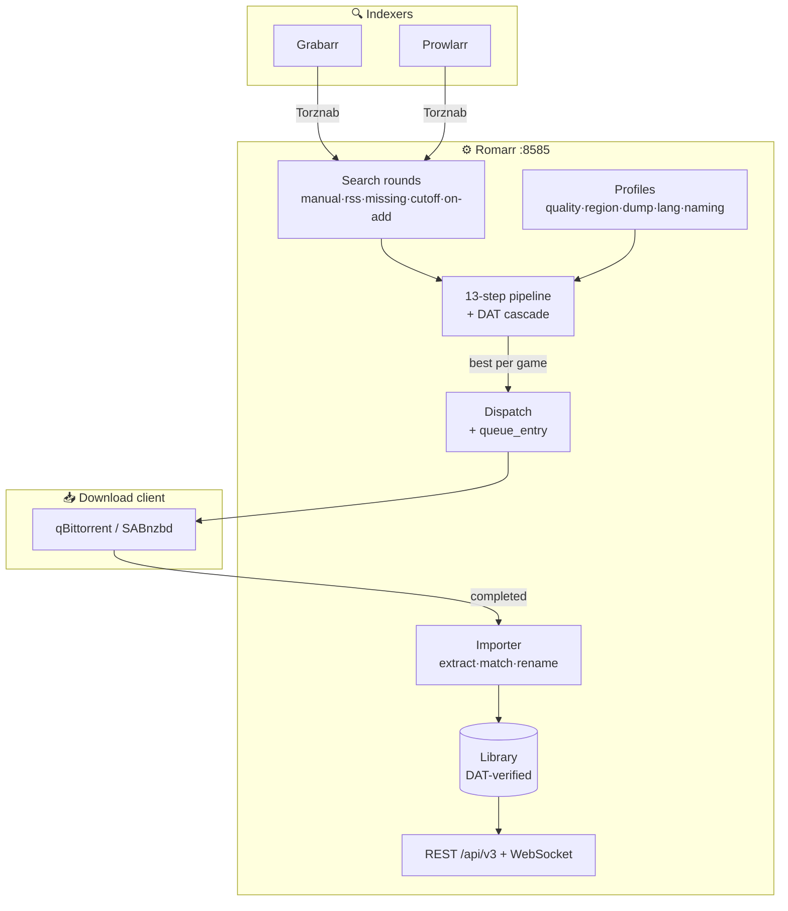
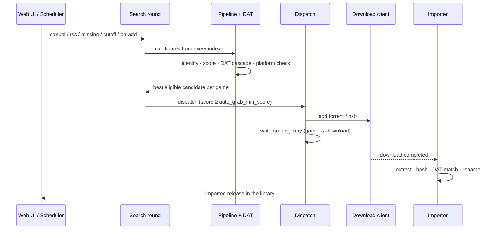

<div align="center">


# Romarr

**Sonarr / Radarr, but for retro game ROMs.**

[](https://github.com/sharkhunterr/romarr/releases)
[](https://hub.docker.com/r/sharkhunterr/romarr)
[](https://hub.docker.com/r/sharkhunterr/romarr)
[](LICENSE)

[](https://python.org)
[](https://fastapi.tiangolo.com)
[](https://sqlalchemy.org)
[](https://react.dev)
[](https://github.com/Sonarr/Sonarr/wiki/Implementing-a-Torznab-indexer)

**[Quick Start](#-quick-start)** •
**[Features](#-features)** •
**[Docker Hub](https://hub.docker.com/r/sharkhunterr/romarr)** •
**[Architecture](#%EF%B8%8F-architecture)**

</div>

---

## 🚀 What is Romarr?

Romarr is a self-hosted **ROM acquisition manager** for the *arr ecosystem. It does for retro video-game ROMs what Sonarr does for TV and Radarr for film: **search, score, grab, identify, import, organise** — driven by a DAT-verified library and the operational discipline of the *arr family.

It searches **Torznab indexers** (Grabarr, Prowlarr), scores every candidate through a five-axis profile system, auto-grabs the best release per game, hands the download to your torrent / usenet client, then extracts, DAT-matches and renames the file into a clean library — all from one bundled React UI.

**Perfect for:**
- 🎮 Retrogamers who want a hands-off, *arr-style ROM library
- 🗂️ Collectors who care about No-Intro / Redump / TOSEC / MAME verification
- 🔌 Homelab operators already running Prowlarr who want ROM sources in the same stack
- 🤖 Anyone who wants RSS / on-add / missing / cutoff auto-grab with a tunable score floor

> [!WARNING]
> **Vibe Coded Project** — this application was built **100% using AI-assisted development** with [Claude Code](https://claude.ai/code).

---

## ✨ Features

<table>
<tr>
<td width="33%" valign="top">

### 🗂️ DAT-Verified Library
**Games · releases · dumps**
- No-Intro / Redump / TOSEC / MAME
- Per-game History tab
- Metadata aggregation (IGDB, ScreenScraper, MobyGames, LaunchBox, RetroAchievements)
- Cover art + bulk monitoring

</td>
<td width="33%" valign="top">

### 🎚️ Profile Scoring
**Five axes + custom formats**
- Quality / Region / Dump / Language / Naming
- Bound per library
- `auto_grab_min_score` floor
- DAT-aware pre-grab cascade

</td>
<td width="33%" valign="top">

### 🔍 Search & Auto-Grab
**One pipeline, every round**
- Manual · RSS · missing · cutoff · on-add
- Best eligible candidate per game
- queue-entry binding for clean imports
- Per-(indexer, game) history rows

</td>
</tr>
</table>

### 🧠 Smart Search Orchestration
- 🎯 13-step decision pipeline shared by **every** round — manual search and auto-grab can never diverge
- 🏷️ DAT pre-grab cascade (SHA-1 / CRC32) tags candidates `verified` / `hack` / `none`
- 🎮 Console / region / language / dump-status / naming-convention extraction per candidate
- 🚫 Platform-mismatch hard reject + already-imported guard so RSS never re-grabs a game
- 🔁 Round-robin de-dup across indexers, best-score-per-game selection

### 🛡️ Operator-Grade Reliability
- 🔍 Per-indexer outcome tracking with structured non-grab reasons
- 🪦 Stale-run sweeper at boot flips stuck scheduler jobs
- 📦 queue reconciler binds completed downloads back to their game for import
- 🔐 Provider credentials encrypted at rest with a Fernet master key
- ❤️ Health engine + Apprise notifications (Sonarr/Radarr-shaped webhook payloads)

### 🎨 Modern Web UI
- 🌓 Dark theme, mobile-first PWA (React 18 + Tailwind + shadcn/ui)
- 🌍 FR + EN day one
- 📊 Activity page — live download + scheduler-task queue, unified History feed with score-breakdown detail sheet
- 🔧 Profile editors, library bindings, indexer setup — no config files

---

## 🏃 Quick Start

### Docker Compose (Recommended)

```yaml
services:
  romarr:
    image: sharkhunterr/romarr:latest
    container_name: romarr
    ports:
      - "8585:8585"
    volumes:
      - ./data:/data
    environment:
      - ROMARR_AUTH_SECRET_KEY=change-me-to-a-32+-char-random-string
      - TZ=Europe/Paris
      - PUID=1000
      - PGID=1000
    restart: unless-stopped
```

```bash
docker compose up -d
docker compose logs romarr | grep setup_token
```

**Access**: http://localhost:8585 — open `/setup`, paste the `token` from the
log line, and create the admin account. The session cookie auto-logs you in.

A fresh container defaults to `ROMARR_BOOTSTRAP_ENABLED=true`,
`ROMARR_AUTO_MIGRATE=true`, `ROMARR_SCHEDULER_ENABLED=true` and
`ROMARR_SPA_ENABLED=true` — it produces a working install with no extra wiring.

### Local development

```bash
cd romarr

# Backend
uv sync --extra dev
ROMARR_AUTH_SECRET_KEY=$(python -c 'import secrets; print(secrets.token_urlsafe(32))') \
  uv run romarr migrate
ROMARR_AUTH_SECRET_KEY=… ROMARR_BOOTSTRAP_ENABLED=true \
  uv run romarr serve --port 8585

# Frontend (separate terminal)
cd web && pnpm install && pnpm dev
```

The Vite dev server proxies `/api/v3/*` to the backend on port 8585.

---

## 🔧 Configuration

### Environment variables (boot-time only)

| Variable | Default | Description |
|----------|---------|-------------|
| `ROMARR_AUTH_SECRET_KEY` | — (**required**) | Fernet master key, 32+ chars — encrypts stored credentials |
| `ROMARR_DATA_DIR` | `/data` | Database + covers + downloads + library root |
| `ROMARR_BOOTSTRAP_ENABLED` | `true` | Seed default profiles + Platform Pack + setup token |
| `ROMARR_AUTO_MIGRATE` | `true` | Run `alembic upgrade head` before boot |
| `ROMARR_SCHEDULER_ENABLED` | `true` | Run the APScheduler job loop (RSS sync, missing/cutoff search…) |
| `ROMARR_SPA_ENABLED` | `true` | Serve the bundled React SPA at `/` |
| `ROMARR_IMPORTER_WATCHER_ENABLED` | `true` | Watch the download client for completed grabs |
| `ROMARR_DATABASE_URL` | SQLite under `DATA_DIR` | Point at PostgreSQL 15+ for a shared DB |
| `PUID` / `PGID` | `1000` | Host-mapped uid/gid (LinuxServer.io convention) |

Everything else — indexers, download clients, profiles, libraries, metadata
providers — is configured **in the UI** and stored in the database.

### First launch

1. **Open** http://localhost:8585 → `/setup` → paste the setup token → create the admin
2. **Add a download client** — Settings → Download Clients (qBittorrent, SABnzbd…)
3. **Add an indexer** — Settings → Indexers → point at Grabarr / Prowlarr (Torznab)
4. **Create a library** — Settings → Libraries → pick its quality / region / dump / language / naming profiles
5. **Add games** — the Library "Add" button searches every metadata provider; pick a title, library and monitored state
6. **Let it run** — on-add search auto-grabs the best release; RSS sync + missing/cutoff search keep the library complete

---

## 🎯 Indexers & DAT Authorities

Romarr does not scrape sites itself — it consumes **Torznab indexers** and
verifies what they return against **DAT authorities**.

| Layer | Role |
|-------|------|
| **Grabarr** | Torznab bridge exposing ROM repositories (Vimm's Lair, Edge Emulation, MiNERVA/Myrient, RomsFun, CDRomance…) |
| **Prowlarr** | Aggregates any other Torznab / Newznab indexer you already run |
| **No-Intro** | Cartridge-based console DAT authority |
| **Redump** | Disc-based console DAT authority |
| **TOSEC / MAME** | Vintage-computer + arcade DAT authorities |

Each candidate is hashed and cross-checked against the imported DAT entries so
the library knows whether a file is a verified dump, a hack, or unknown — and
the scoring pipeline weights it accordingly.

---

## 🏗️ Architecture

One multi-stage Docker image bundles the React SPA and the FastAPI backend.



### Search → grab → import flow



---

## 🛠️ Technology Stack

| Layer | Technologies |
|-------|--------------|
| **Backend** | Python 3.12 • FastAPI (async) • SQLAlchemy 2.0 • Pydantic v2 • Alembic • `uv` |
| **Frontend** | React 18 • TypeScript (strict) • Vite • Tailwind • shadcn/ui • PWA |
| **Storage** | SQLite (default) • PostgreSQL 15+ (optional) • Redis 7+ cache (optional, in-memory fallback) |
| **API** | REST `/api/v3/*` (Sonarr v3-shaped) • SignalR-compat WebSocket |
| **Auth** | Forms login • OIDC SSO • per-user API keys • trusted-proxy headers • RBAC |
| **Scheduler** | APScheduler • per-job runners (RSS sync, missing/cutoff search, metadata refresh, DAT update, backup) |
| **DevOps** | Docker (multi-arch) • GitLab CI (tag-only pipeline) • standard-version |

---

## 📦 Data & Backup

Everything lives under one volume — `/data` (`ROMARR_DATA_DIR`).

| Path | Content |
|------|---------|
| `/data/romarr.db` | SQLite — games, releases, dumps, profiles, settings, API keys |
| `/data/covers/` | Cached cover art |
| `/data/downloads/` | Staging area for in-flight grabs |
| `/data/library/` | The imported, DAT-matched, renamed ROM library |

Back it up by snapshotting `/data`; restore by mounting it into a fresh
container. SQLite migrations run automatically on first boot via Alembic, so
upgrades preserve every game, release, profile and credential.

---

## 📚 Documentation

| Document | Purpose |
|----------|---------|
| [romarr/docs/](romarr/docs/) | API reference + protocol notes |
| [romarr/specs/](romarr/specs/) | Full spec catalogue (clarify → plan → tasks) |
| [CHANGELOG.md](CHANGELOG.md) | Versioned release notes |
| [scripts/README.md](scripts/README.md) | Release + deploy command reference |

---

## 🤝 Contributing

Contributions welcome! Please:

1. Fork the repository
2. Create a feature branch
3. Run `uv run ruff check` and `uv run pytest`
4. Submit a pull request

---

## 🚫 Non-goals

Romarr is **not** an emulator, **not** a metadata-only catalogue, **not** a
generic download manager, and does **not** host or redistribute ROMs. It
manages *your* library by talking to indexers and download clients you
already operate.

---

## 🙏 Acknowledgments

**The Need**: the *arr ecosystem is brilliant for media you can torrent, but
retro ROMs live across a patchwork of repositories with no shared catalogue,
no quality scoring, and no DAT verification. Keeping a clean collection meant
hours of manual hashing and renaming.

**The Solution**: Romarr brings the *arr workflow to ROMs — connect an
indexer once, define your profiles, and let search → grab → import keep a
DAT-verified library complete and correctly named.

**The Approach**: As a young parent with limited time and no fullstack
development experience, traditional coding wasn't an option. Built entirely
through [Claude Code](https://claude.ai/code) using "vibe coding" — pure
conversation, no manual coding required.

Built in the spirit of [RomM](https://github.com/rommapp/romm) and the
[*arr](https://wiki.servarr.com/) family.

---

## 📄 License

[GPL-3.0-or-later](LICENSE).

---

<div align="center">

**Built with Claude Code 🤖 for the homelab community 🏠**

[](https://github.com/sharkhunterr/romarr)
[](https://hub.docker.com/r/sharkhunterr/romarr)

[⭐ Star on GitHub](https://github.com/sharkhunterr/romarr) • [🐛 Report Bug](https://github.com/sharkhunterr/romarr/issues) • [💡 Request Feature](https://github.com/sharkhunterr/romarr/issues)

</div>
