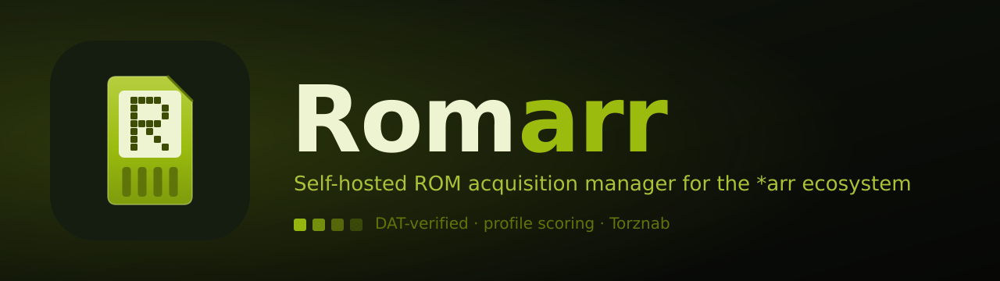

<div align="center">



# Romarr

**Sonarr / Radarr, but for retro game ROMs.**

[](https://github.com/sharkhunterr/romarr/releases)
[](https://hub.docker.com/r/sharkhunterr/romarr)
[](https://hub.docker.com/r/sharkhunterr/romarr)
[](LICENSE)

[](https://python.org)
[](https://fastapi.tiangolo.com)
[](https://sqlalchemy.org)
[](https://react.dev)
[](https://github.com/Sonarr/Sonarr/wiki/Implementing-a-Torznab-indexer)

**[Quick Start](#-quick-start)** •
**[Features](#-features)** •
**[Docker Hub](https://hub.docker.com/r/sharkhunterr/romarr)** •
**[Architecture](#%EF%B8%8F-architecture)** •
**[Release workflow](#-release-workflow)**

</div>

---

## 🚀 What is Romarr?

Romarr is a self-hosted **ROM acquisition manager** for the *arr ecosystem. It does for retro video-game ROMs what Sonarr does for TV and Radarr for film: **search, score, grab, identify, import, organise** — with a DAT-verified library and the operational discipline of the *arr family.

It searches across **Grabarr** + **Prowlarr** Torznab indexers, scores every candidate through a five-axis profile system (quality / region / dump / language / naming + custom formats), auto-grabs the best release per game, and imports the file into a DAT-matched, cleanly-named library — all from one bundled React UI.

**Perfect for:**
- 🎮 Retrogamers who want a hands-off, *arr-style ROM library
- 🗂️ Collectors who care about No-Intro / Redump / TOSEC verification
- 🔌 Homelab operators already running Prowlarr who want one more indexer slot to cover ROM sources
- 🤖 Anyone who wants RSS / on-add / missing / cutoff auto-grab with a tunable score floor

> [!WARNING]
> **Vibe Coded Project** — this application was built **100% using AI-assisted development** with [Claude Code](https://claude.ai/code).

---

## ✨ Features

<table>
<tr>
<td width="33%" valign="top">

### 🗂️ DAT-Verified Library
**Games, releases, dumps**
- No-Intro / Redump / TOSEC / MAME
- Per-game History tab
- Metadata aggregation (IGDB, ScreenScraper, MobyGames…)
- Cover art + bulk monitoring

</td>
<td width="33%" valign="top">

### 🎚️ Profile Scoring
**Five axes + custom formats**
- Quality / Region / Dump / Language / Naming
- Bound per library
- `auto_grab_min_score` floor
- DAT-aware pre-grab cascade

</td>
<td width="33%" valign="top">

### 🔍 Search & Auto-Grab
**One pipeline, every round**
- Manual / RSS / missing / cutoff / on-add
- Best eligible candidate per game
- queue-entry binding for clean imports
- Per-(indexer, game) history rows

</td>
</tr>
<tr>
<td width="33%" valign="top">

### 📊 Activity
**Live queue + audit trail**
- Download + scheduler-task progress
- Unified History feed
- Click-through detail sheet with score breakdown

</td>
<td width="33%" valign="top">

### 📦 Import Pipeline
**Webhook → extract → match → move**
- Archive extraction
- Hash + DAT identification
- Convention-aware renaming
- Library exporters (RomM, ES-DE…)

</td>
<td width="33%" valign="top">

### 🎨 Modern Web UI
**React 18 · PWA · mobile-first**
- FR + EN day one
- Bundled in the Docker image
- SignalR-compat WebSocket

</td>
</tr>
</table>

---

## 🏃 Quick Start

### Docker (recommended)

```bash
docker run -d \
  --name romarr \
  -p 8585:8585 \
  -v /srv/romarr/data:/data \
  -e ROMARR_AUTH_SECRET_KEY="$(python -c 'import secrets; print(secrets.token_urlsafe(32))')" \
  sharkhunterr/romarr:latest

docker logs romarr | grep setup_token
```

Capture the `token` from the WARNING line, open `http://localhost:8585/setup`, paste it, and create the admin account. The session cookie auto-logs you in.

A fresh container defaults to `ROMARR_BOOTSTRAP_ENABLED=true`, `ROMARR_AUTO_MIGRATE=true`, `ROMARR_SCHEDULER_ENABLED=true` and `ROMARR_SPA_ENABLED=true` — it produces a working install with no extra wiring.

### Local development

```bash
cd romarr

# Backend
uv sync --extra dev
ROMARR_AUTH_SECRET_KEY=$(python -c 'import secrets; print(secrets.token_urlsafe(32))') \
  uv run romarr migrate
ROMARR_AUTH_SECRET_KEY=… ROMARR_BOOTSTRAP_ENABLED=true \
  uv run romarr serve --port 8585

# Frontend (separate terminal)
cd web && pnpm install && pnpm dev
```

The Vite dev server proxies `/api/v3/*` to the backend on port 8585.

---

## 🔧 Configuration

Boot-time environment variables (full list in `romarr.config.settings`):

| Variable | Default | Purpose |
|---|---|---|
| `ROMARR_AUTH_SECRET_KEY` | — (**required**) | Fernet master key, 32+ chars |
| `ROMARR_DATA_DIR` | `/data` | Data root inside the image |
| `ROMARR_BOOTSTRAP_ENABLED` | `true` | Seed defaults + Platform Pack + setup token |
| `ROMARR_AUTO_MIGRATE` | `true` | Run `alembic upgrade head` pre-boot |
| `ROMARR_SCHEDULER_ENABLED` | `true` | Run the APScheduler job loop |
| `ROMARR_SPA_ENABLED` | `true` | Serve the bundled React SPA at `/` |
| `PUID` / `PGID` | `1000` | Host-mapped uid/gid (LinuxServer convention) |

---

## 🏗️ Architecture

One multi-stage Docker image bundles the React SPA and the FastAPI backend.

```
┌──────────────┐   Torznab    ┌───────────┐   pick best   ┌──────────────┐
│  Grabarr /   │ ───────────▶ │  Search   │ ────────────▶ │  Dispatch +  │
│  Prowlarr    │   indexers   │  rounds   │  per-game     │  queue_entry │
└──────────────┘              └─────┬─────┘  score floor  └──────┬───────┘
                                    │                            │
                              profile cascade              download client
                         quality·region·dump·lang·naming         │
                                    │                            ▼
                              ┌─────▼─────┐              ┌──────────────┐
                              │  Library  │ ◀─────────── │   Importer   │
                              │ DAT-match │   extract +  │ hash · match │
                              └───────────┘   rename     └──────────────┘
```

Search rounds — **manual**, **RSS sync**, **missing**, **cutoff**, **on-add** — all run the same DAT-aware scoring pipeline through one shared dispatch helper, so an auto-grab picks exactly the release the manual modal would rank top.

---

## 🛠️ Technology Stack

| Layer | Tech |
|---|---|
| Backend | Python 3.12+, FastAPI, SQLAlchemy 2.0 (async), Pydantic v2, Alembic |
| Storage | SQLite (default) · PostgreSQL 15+ (optional) · Redis 7+ cache (optional) |
| Frontend | React 18 + TypeScript strict + Vite + Tailwind + shadcn/ui (PWA) |
| API | REST `/api/v3/*` (Sonarr v3-shaped) + SignalR-compat WebSocket |
| Auth | Forms login · OIDC SSO · per-user API keys · trusted-proxy · RBAC |
| Packaging | `uv` workspace · multi-stage Docker (Node 20 SPA → Python 3.12 runtime) |

---

## 📦 Data & Backup

Everything lives under one volume — `/data` (`ROMARR_DATA_DIR`): the SQLite
database, covers, downloads and the library tree. Back it up by snapshotting
that directory; restore by mounting it into a fresh container.

---

## 🚢 Release workflow

Romarr ships through a **tag-only GitLab → Docker Hub → GitHub** pipeline,
the same template used across the sharkhunterr *arr projects. The release
tooling lives at the **git root** (`package.json`, `scripts/`,
`.gitlab-ci.yml`); the romarr project itself is nested in `romarr/`.

```bash
npm install                  # one-time: standard-version

npm run release              # patch bump, push tag to GitLab
npm run release:minor        # minor bump
npm run release:full         # bump + GitHub mirror + Docker Hub deploy
npm run release:dry          # preview, change nothing
```

`npm run release:full` bumps the version across `package.json`,
`romarr/pyproject.toml` and `romarr/src/romarr/__init__.py`, regenerates
`CHANGELOG.md` from conventional commits, tags `vX.Y.Z`, and pushes with
`-o ci.variable=DEPLOY=true`. The GitLab pipeline then **tests → builds the
Docker image → publishes to Docker Hub → mirrors to GitHub → creates the
GitLab + GitHub releases → verifies** the artifacts landed.

See [`scripts/README.md`](scripts/README.md) for the full command set and the
CI variables to configure.

### Graphic identity

The brand assets (Game Boy LCD-green ROM cartridge) are SVG sources under
[`assets/`](assets/); `npm run assets` renders the PNG icon / favicon / banner
set and installs the web-facing ones into `romarr/web/public/`.

---

## 📄 License

[GPL-3.0-or-later](LICENSE).
