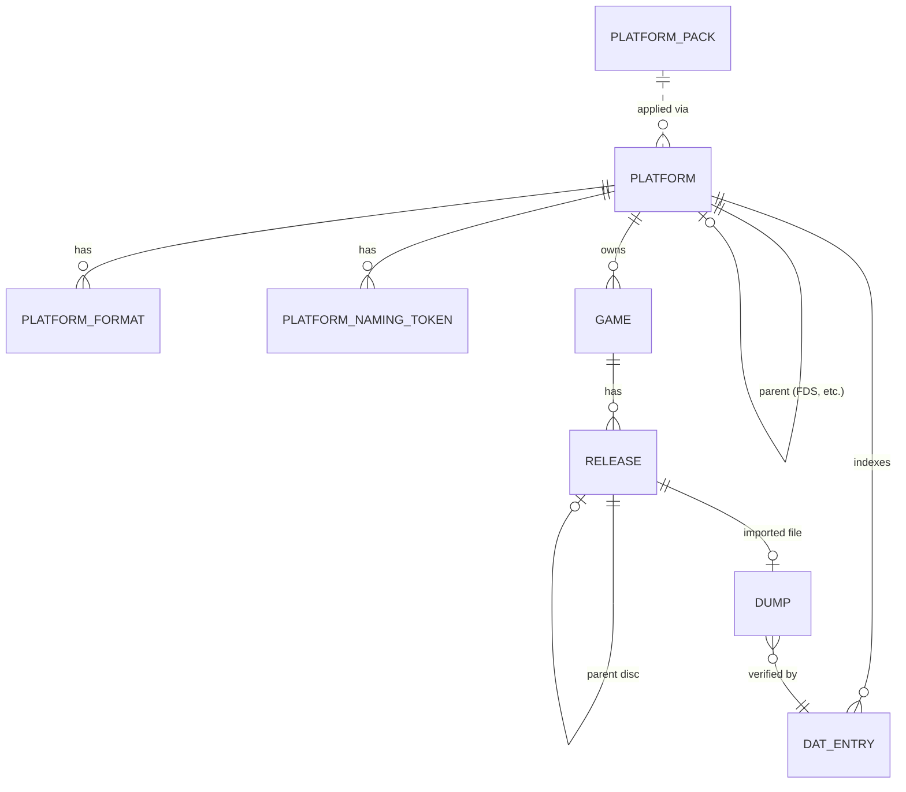

# Data Model — Foundation

This document is the source of truth for the foundation feature's
persistence layer. It is consumed by the Alembic baseline migration
(`0001_initial_schema.py`) and by every SQLAlchemy 2.0 async model in
`src/romarr/domain/models/`. Pydantic v2 schemas in
`src/romarr/domain/schemas/` mirror these tables one-for-one with three
variants per entity (`*Read`, `*Create`, `*Update`).

## Entity-Relationship Diagram



## ENUM Reference

```text
DumpStatus       = unknown | verified | good | hack | trainer | translation
                 | proto | beta | demo | sample | pirate | baddump
                 | overdump | fixed | alt
NamingConvention = no-intro | redump | tosec | goodtools | scene | unknown
ReleaseStatus    = wanted | searching | grabbed | downloading | imported
                 | failed | cutoff_met
GameStatus       = announced | released | mia | cancelled
PackSource       = builtin | community | user
FormatType       = cartridge | disc | compressed | archive | package
TokenMeaning     = serial | revision | content_type | custom
DatSource        = no-intro | redump | tosec | hasheous | playmatch
ImportedVia      = manual | automatic | rss | api
```

ENUMs are persisted as **CHECK-constrained TEXT** columns rather than DB
ENUM types so the SQLite/PostgreSQL parity is trivial. The Python side
exposes them as `enum.StrEnum` subclasses living in
`src/romarr/domain/enums.py`.

## Tables

### 1. `platform`

| Column | Type | Constraints / Notes |
|---|---|---|
| `id` | INTEGER | PK, autoincrement |
| `slug` | TEXT | UNIQUE NOT NULL; lowercase kebab-case (FR-007) |
| `name` | TEXT | NOT NULL |
| `short_name` | TEXT | nullable |
| `igdb_id` | INTEGER | nullable |
| `screenscraper_id` | INTEGER | nullable |
| `mobygames_id` | INTEGER | nullable |
| `thegamesdb_id` | INTEGER | nullable |
| `launchbox_id` | INTEGER | nullable |
| `hasheous_id` | INTEGER | nullable |
| `retroachievements_id` | INTEGER | nullable |
| `manufacturer` | TEXT | nullable |
| `generation` | INTEGER | nullable |
| `release_year` | INTEGER | nullable |
| `is_handheld` | BOOLEAN | NOT NULL DEFAULT false |
| `is_disc_based` | BOOLEAN | NOT NULL DEFAULT false |
| `parent_platform_id` | INTEGER | nullable, FK → `platform.id` ON DELETE SET NULL |
| `icon_url` | TEXT | nullable |
| `custom_metadata` | JSON | nullable |
| `pack_version` | TEXT | nullable |
| `pack_source` | TEXT | NOT NULL CHECK in `('builtin','community','user')` |
| `created_at` | TIMESTAMP | NOT NULL DEFAULT CURRENT_TIMESTAMP |
| `updated_at` | TIMESTAMP | NOT NULL DEFAULT CURRENT_TIMESTAMP |

Indexes: implicit on PK and unique on `slug`.

Validators (Python-side, in `domain/validators.py`):

- `slug` matches `^[a-z0-9]+(-[a-z0-9]+)*$`.

### 2. `platform_format`

| Column | Type | Constraints / Notes |
|---|---|---|
| `id` | INTEGER | PK |
| `platform_id` | INTEGER | NOT NULL, FK → `platform.id` ON DELETE CASCADE |
| `extension` | TEXT | NOT NULL; stored without leading dot (`nes`, not `.nes`) |
| `format_type` | TEXT | NOT NULL CHECK in `('cartridge','disc','compressed','archive','package')` |
| `is_primary` | BOOLEAN | NOT NULL DEFAULT false |
| `is_compressed` | BOOLEAN | NOT NULL DEFAULT false |
| `requires_companion` | BOOLEAN | NOT NULL DEFAULT false |
| `companion_extensions` | JSON | nullable; list of strings |
| `parser_strategy` | TEXT | nullable; key into the platform-pack parsing-strategies dictionary |
| `header_offset` | INTEGER | nullable; absolute byte offset where header begins |
| `header_signature_hex` | TEXT | nullable; e.g. `4E455331A` for iNES |
| `pack_version` | TEXT | nullable |
| `pack_source` | TEXT | NOT NULL CHECK same as `platform.pack_source` |

Indexes:

- `UNIQUE (platform_id, extension)`

### 3. `platform_naming_token`

| Column | Type | Constraints / Notes |
|---|---|---|
| `id` | INTEGER | PK |
| `platform_id` | INTEGER | NOT NULL, FK → `platform.id` ON DELETE CASCADE |
| `token_pattern` | TEXT | NOT NULL; valid Python regex |
| `token_meaning` | TEXT | NOT NULL CHECK in `('serial','revision','content_type','custom')` |
| `description` | TEXT | nullable |
| `example` | TEXT | nullable |
| `pack_version` | TEXT | nullable |
| `pack_source` | TEXT | NOT NULL CHECK same as above |

### 4. `game`

| Column | Type | Constraints / Notes |
|---|---|---|
| `id` | INTEGER | PK |
| `platform_id` | INTEGER | NOT NULL, FK → `platform.id` **ON DELETE RESTRICT** |
| `igdb_id` | INTEGER | nullable |
| `title` | TEXT | NOT NULL |
| `sort_title` | TEXT | NOT NULL (computed in `*Create` if not given) |
| `slug` | TEXT | NOT NULL; per-platform unique |
| `summary` | TEXT | nullable |
| `description` | TEXT | nullable |
| `developer` | TEXT | nullable |
| `publisher` | TEXT | nullable |
| `release_date` | DATE | nullable |
| `genres` | JSON | nullable; list of strings |
| `themes` | JSON | nullable; list of strings |
| `franchises` | JSON | nullable; list of strings |
| `cover_url` | TEXT | nullable |
| `cover_source` | TEXT | nullable |
| `rating_igdb` | NUMERIC(4,1) | nullable |
| `age_rating` | TEXT | nullable |
| `monitored` | BOOLEAN | NOT NULL DEFAULT true |
| `status` | TEXT | NOT NULL CHECK in `('announced','released','mia','cancelled')` DEFAULT `'released'` |
| `locked_fields` | JSON | nullable; list of field names that the operator pinned |
| `metadata_locked` | BOOLEAN | NOT NULL DEFAULT false |
| `added_at` | TIMESTAMP | NOT NULL DEFAULT CURRENT_TIMESTAMP |
| `updated_at` | TIMESTAMP | NOT NULL DEFAULT CURRENT_TIMESTAMP |

Indexes:

- `UNIQUE (platform_id, slug)` (FR-002)
- partial unique: `UNIQUE (platform_id, igdb_id) WHERE igdb_id IS NOT NULL`
  (encoded via a partial index on PostgreSQL and a check-trigger on
  SQLite; alternatively, a uniqueness validator in the service layer with
  a redundant DB index — final implementation chooses the partial index).

### 5. `release`

| Column | Type | Constraints / Notes |
|---|---|---|
| `id` | INTEGER | PK |
| `game_id` | INTEGER | NOT NULL, FK → `game.id` **ON DELETE CASCADE** |
| `name` | TEXT | NOT NULL; original release name (e.g. `Sonic the Hedgehog (USA)`) |
| `regions` | JSON | NOT NULL; list of ISO-3166-1 alpha-2 codes |
| `languages` | JSON | NOT NULL; list of ISO-639-1 codes |
| `revision` | TEXT | nullable; e.g. `Rev A`, `v1.1`, empty for "Rev 0" |
| `dump_status` | TEXT | NOT NULL CHECK matches `DumpStatus` |
| `naming_convention` | TEXT | NOT NULL CHECK matches `NamingConvention` |
| `tags` | JSON | nullable; e.g. `["[!]","[T+Fr]"]` |
| `disc_number` | INTEGER | NOT NULL DEFAULT 1 |
| `disc_total` | INTEGER | NOT NULL DEFAULT 1 |
| `parent_release_id` | INTEGER | nullable, FK → `release.id` ON DELETE SET NULL |
| `monitored` | BOOLEAN | NOT NULL DEFAULT true |
| `status` | TEXT | NOT NULL CHECK matches `ReleaseStatus` DEFAULT `'wanted'` |
| `score` | INTEGER | NOT NULL DEFAULT 0 |
| `added_at` | TIMESTAMP | NOT NULL DEFAULT CURRENT_TIMESTAMP |
| `updated_at` | TIMESTAMP | NOT NULL DEFAULT CURRENT_TIMESTAMP |

Invariants (CHECK constraints + Python validators):

- `disc_number >= 1`, `disc_total >= 1`, `disc_number <= disc_total`.
- `disc_number > 1 ⇒ parent_release_id IS NOT NULL` (FR-004).
- `disc_number = 1 AND parent_release_id IS NULL ⇒ disc_total >= 1`
  (single-disc OR parent of a multi-disc set).
- A Release referenced as `parent_release_id` MUST itself have
  `disc_number = 1` AND `disc_total > 1` (enforced by service-layer check
  + integration test).

### 6. `dump`

| Column | Type | Constraints / Notes |
|---|---|---|
| `id` | INTEGER | PK |
| `release_id` | INTEGER | NOT NULL, FK → `release.id` ON DELETE CASCADE |
| `path` | TEXT | UNIQUE NOT NULL; absolute path |
| `size_bytes` | BIGINT | NOT NULL |
| `crc32` | TEXT | nullable; lowercase hex, 8 chars |
| `md5` | TEXT | nullable; lowercase hex, 32 chars |
| `sha1` | TEXT | nullable; lowercase hex, 40 chars |
| `sha256` | TEXT | nullable; lowercase hex, 64 chars |
| `format` | TEXT | nullable; e.g. `md`, `bin`, `chd` |
| `format_compressed` | TEXT | nullable; e.g. `zip`, `7z`, `chd` |
| `dat_verified` | BOOLEAN | NOT NULL DEFAULT false |
| `dat_source` | TEXT | nullable CHECK in `('no-intro','redump','tosec','hasheous','playmatch')` or NULL |
| `dat_entry_id` | INTEGER | nullable, FK → `dat_entry.id` ON DELETE SET NULL |
| `original_filename` | TEXT | nullable |
| `imported_at` | TIMESTAMP | NOT NULL DEFAULT CURRENT_TIMESTAMP |
| `imported_via` | TEXT | NOT NULL CHECK in `('manual','automatic','rss','api')` |

Invariants:

- `dump.path` globally unique (FR-005).
- Cross-table check: `dump.release_id → release.game_id → game.platform_id`
  must equal the platform implied by the file. Enforced in the service
  layer at insert time (FR-005); not as a SQL trigger to keep the schema
  portable.

Indexes:

- UNIQUE on `path`.
- non-unique on each of `crc32`, `md5`, `sha1` to support reverse-lookup
  from a hash to existing imported dumps.

### 7. `dat_entry`

| Column | Type | Constraints / Notes |
|---|---|---|
| `id` | INTEGER | PK |
| `source` | TEXT | NOT NULL CHECK in `('no-intro','redump','tosec','hasheous','playmatch')` |
| `dat_version` | TEXT | NOT NULL |
| `platform_id` | INTEGER | NOT NULL, FK → `platform.id` ON DELETE CASCADE |
| `name` | TEXT | NOT NULL |
| `crc32` | TEXT | nullable |
| `md5` | TEXT | nullable |
| `sha1` | TEXT | nullable |
| `sha256` | TEXT | nullable |
| `size_bytes` | BIGINT | nullable |
| `status` | TEXT | NOT NULL CHECK in `('verified','proto','beta','demo','hack','overdump','baddump')` |
| `extra_meta` | JSON | nullable |
| `ingested_at` | TIMESTAMP | NOT NULL DEFAULT CURRENT_TIMESTAMP |

Invariants (FR-006):

- CHECK `(crc32 IS NOT NULL OR md5 IS NOT NULL OR sha1 IS NOT NULL)`.

Indexes:

- `(platform_id, sha1)`
- `(platform_id, crc32)`
- `(platform_id, md5)`
- `(platform_id, name)`

### 8. `unidentified_dump`

| Column | Type | Constraints / Notes |
|---|---|---|
| `id` | INTEGER | PK |
| `path` | TEXT | NOT NULL |
| `size_bytes` | BIGINT | NOT NULL |
| `sha1` | TEXT | nullable |
| `crc32` | TEXT | nullable |
| `discovered_at` | TIMESTAMP | NOT NULL DEFAULT CURRENT_TIMESTAMP |
| `last_attempt` | TIMESTAMP | nullable |
| `attempt_count` | INTEGER | NOT NULL DEFAULT 0 |
| `last_error` | TEXT | nullable |

Indexes: non-unique on `sha1`; non-unique on `path` (a file may move and
generate a new row — that is acceptable here).

### 9. `platform_pack`

| Column | Type | Constraints / Notes |
|---|---|---|
| `id` | INTEGER | PK |
| `version` | TEXT | UNIQUE NOT NULL; date-based, e.g. `2026.04.001` |
| `source_url` | TEXT | nullable |
| `description` | TEXT | nullable |
| `applied_at` | TIMESTAMP | NOT NULL DEFAULT CURRENT_TIMESTAMP |
| `applied_by` | TEXT | nullable; user id later, NULL for the built-in seed |
| `contents_hash` | TEXT | NOT NULL; SHA-256 of the canonical pack body |

Used by the future Platform Packs spec. In this foundation feature the
table exists and a single row is inserted by the Alembic baseline to
record the **builtin-2026.04.001** seed of the 5 MVP platforms.

## Initial Seed (Alembic baseline)

The baseline migration MUST insert one `platform_pack` row plus the five
MVP platforms with their formats, marked `pack_source = 'builtin'`,
`pack_version = '2026.04.001'`.

| slug | name | manufacturer | gen | handheld | disc-based | extensions |
|---|---|---|---|---|---|---|
| `nes` | Nintendo Entertainment System | Nintendo | 3 | false | false | `nes` |
| `snes` | Super Nintendo Entertainment System | Nintendo | 4 | false | false | `sfc`, `smc`, `fig` |
| `megadrive` | Mega Drive | Sega | 4 | false | false | `md`, `smd`, `bin`, `gen` |
| `gameboy` | Game Boy | Nintendo | 4 | true | false | `gb` |
| `gba` | Game Boy Advance | Nintendo | 6 | true | false | `gba` |

For each, the first listed extension is `is_primary = true`. No naming
tokens are seeded by the baseline — those arrive with the future Platform
Packs spec.

## Pydantic Schemas (one slice per entity)

Each entity has three schemas in `src/romarr/domain/schemas/`:

- `*Read` — every persisted column, plus computed properties:
  `Game.platform_slug`, `Release.is_multi_disc_parent`,
  `Release.is_multi_disc_child`, `Dump.has_any_hash`.
- `*Create` — required fields only. For Game, `slug` is computed from
  `title` if omitted. For Release, `regions` and `languages` are required
  even if empty (caller must pass `[]` explicitly to be safe).
- `*Update` — every field optional; `model_config = ConfigDict(extra='forbid')`.

All schemas:

- `model_config = ConfigDict(from_attributes=True, str_strip_whitespace=True, extra='forbid')`.
- Validators reuse the helpers from `domain/validators.py` (slug regex,
  hash hex format, ISO-3166-1 alpha-2 list, ISO-639-1 list).

## Identification-side Value Types

These live in `src/romarr/identification/types.py`. They are *not*
persisted in this feature — they are the working memory of the pipeline.

```python
class ParsedFilename(BaseModel):
    title: str
    regions: list[str]            # ISO-3166-1 alpha-2
    languages: list[str]          # ISO-639-1
    revision: str | None
    dump_status: DumpStatus
    tags: list[str]
    convention: NamingConvention
    confidence: float             # 0.0 – 1.0

class HeaderInfo(BaseModel):
    platform_slug: str | None
    serial: str | None
    region: str | None
    extras: dict[str, Any]        # platform-specific (mapper, PRG/CHR sizes, …)

class IdentificationSource(BaseModel):
    kind: Literal["hash","torznab","header","filename"]
    confidence: float
    fields: dict[str, Any]        # the data this source contributes
    provenance: str               # e.g. "no-intro:megadrive:v2026-04-01"

class Conflict(BaseModel):
    field: str
    sources: list[IdentificationSource]
    chosen: str                   # provenance string of the winning source

class Identification(BaseModel):
    platform_slug: str | None
    title: str | None
    regions: list[str]
    languages: list[str]
    revision: str | None
    dump_status: DumpStatus
    convention: NamingConvention
    confidence: float             # max() across sources, -10% per conflict family
    sources: list[IdentificationSource]
    conflicts: list[Conflict]
```

These types are the public shape returned by `Identifier.identify(...)`.
Downstream specs (Importer, Search) consume them.
