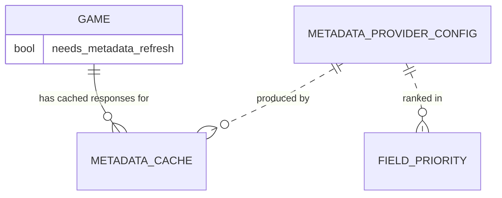

# Data Model — Metadata Aggregation

This document is the source of truth for the metadata feature's
persistence layer. It is consumed by Alembic migration
`0002_metadata_layer.py` and by the SQLAlchemy 2.0 async models in
`src/romarr/metadata/`. It defines **three new tables** plus a small
column addition to the existing `game` table.

## Entity-Relationship Additions



The `metadata_provider_config` table has an implicit logical link to
`metadata_cache` and `field_priority` via `provider_name`. We do **not**
enforce a SQL FK on `provider_name` because the registry is a closed
enumeration in code (`igdb`, `screenscraper`, `mobygames`, `launchbox`,
`steamgriddb`, `retroachievements`, `howlongtobeat`, `hasheous`,
`playmatch`); a stale row referencing a removed provider is a no-op
because the registry resolves it to `None`.

## Modification — `game.needs_metadata_refresh`

The existing `game` table gains one boolean column:

| Column | Type | Constraints / Notes |
|---|---|---|
| `needs_metadata_refresh` | BOOLEAN | NOT NULL DEFAULT false |

Set to `true` whenever an aggregation pass produced no usable data
(every enabled provider failed or returned empty). Reset to `false`
on the next successful aggregation.

## Tables

### 1. `metadata_provider_config`

Persists the per-provider toggle and credentials. Credentials are
**encrypted at rest** using a Fernet key derived from
`ROMARR_AUTH_SECRET_KEY` (see `src/romarr/metadata/encryption.py`).

| Column | Type | Constraints / Notes |
|---|---|---|
| `id` | INTEGER | PK |
| `provider_name` | TEXT | UNIQUE NOT NULL CHECK in (`igdb`, `screenscraper`, `mobygames`, `launchbox`, `steamgriddb`, `retroachievements`, `howlongtobeat`, `hasheous`, `playmatch`) |
| `enabled` | BOOLEAN | NOT NULL DEFAULT false |
| `config_encrypted` | BLOB | nullable; Fernet token wrapping a JSON object holding the credentials |
| `priority_global` | INTEGER | NOT NULL DEFAULT 100; lower number = higher priority; only used as a fallback when no `field_priority` row exists for a given field |
| `cache_ttl_seconds` | INTEGER | NOT NULL DEFAULT 2592000 (= 30 days, FR-015) |
| `last_health_check_at` | TIMESTAMP | nullable |
| `last_health_check_ok` | BOOLEAN | nullable |
| `created_at` | TIMESTAMP | NOT NULL DEFAULT CURRENT_TIMESTAMP |
| `updated_at` | TIMESTAMP | NOT NULL DEFAULT CURRENT_TIMESTAMP |

Indexes:

- UNIQUE on `provider_name`.

Initial seed (idempotent insert): one row per provider with
`enabled = false`, `config_encrypted = NULL`, `priority_global` set per
the table below.

| provider_name | priority_global |
|---|---|
| `igdb` | 10 |
| `screenscraper` | 20 |
| `mobygames` | 30 |
| `launchbox` | 40 |
| `hasheous` | 50 |
| `playmatch` | 60 |
| `retroachievements` | 70 |
| `howlongtobeat` | 80 |
| `steamgriddb` | 90 |

### 2. `metadata_cache`

Stores the raw provider response for a single Game. Aggregation never
re-issues an HTTP call when a row exists with `expires_at > NOW()`.

| Column | Type | Constraints / Notes |
|---|---|---|
| `id` | INTEGER | PK |
| `provider_name` | TEXT | NOT NULL; same CHECK list as `metadata_provider_config.provider_name` |
| `provider_game_id` | TEXT | NOT NULL; provider's native ID (string for portability across providers) |
| `game_id` | INTEGER | NOT NULL, FK → `game.id` ON DELETE CASCADE |
| `data` | JSON | NOT NULL; the provider's raw response body, normalized to JSON |
| `fetched_at` | TIMESTAMP | NOT NULL DEFAULT CURRENT_TIMESTAMP |
| `expires_at` | TIMESTAMP | NOT NULL; `fetched_at + provider's cache_ttl_seconds` |

Indexes:

- UNIQUE on `(provider_name, provider_game_id)` — prevents duplicate
  cache rows for the same provider/game.
- non-unique on `(game_id, provider_name)` — fast lookup per Game when
  aggregating.
- non-unique on `expires_at` — to support a future cleanup task.

Notes:

- The `data` column carries the **normalized** representation, not
  always the wire format. ScreenScraper returns XML; we transform to
  JSON at the boundary so the aggregator never has to know.
- Cover bytes are NOT stored here — covers live on disk under
  `data/covers/<game_id>.<ext>`. The cache row only stores the cover
  URL, the bytes hash, and the chosen extension.

### 3. `field_priority`

Per-field ordered preference of providers. A row exists for each
(field_name, provider_name) pair that is allowed to contribute to that
field. The `priority_order` column is the rank within the field
(1 = highest).

| Column | Type | Constraints / Notes |
|---|---|---|
| `field_name` | TEXT | NOT NULL; one of the canonical field names (see seed below) |
| `provider_name` | TEXT | NOT NULL; same CHECK list as above |
| `priority_order` | INTEGER | NOT NULL; 1 = highest |
| `updated_at` | TIMESTAMP | NOT NULL DEFAULT CURRENT_TIMESTAMP |

Constraints:

- Composite PK on `(field_name, provider_name)`.
- UNIQUE on `(field_name, priority_order)` — no two providers can
  share the same rank within a field.

Indexes (covered by the constraints above):

- The composite PK is the lookup index for the aggregator.

#### Default seed

Inserted by `0002_metadata_layer.py` on first migrate. Mirrors the
RomM-aligned defaults in the constitution (Article IX):

| field_name | priority_order | provider_name |
|---|---|---|
| `title` | 1 | `igdb` |
| `title` | 2 | `screenscraper` |
| `title` | 3 | `mobygames` |
| `title` | 4 | `launchbox` |
| `summary` | 1 | `igdb` |
| `summary` | 2 | `mobygames` |
| `summary` | 3 | `screenscraper` |
| `cover` | 1 | `igdb` |
| `cover` | 2 | `screenscraper` |
| `cover` | 3 | `steamgriddb` |
| `cover` | 4 | `launchbox` |
| `genres` | 1 | `igdb` |
| `genres` | 2 | `mobygames` |
| `genres` | 3 | `launchbox` |
| `release_date` | 1 | `mobygames` |
| `release_date` | 2 | `igdb` |
| `release_date` | 3 | `screenscraper` |
| `developer` | 1 | `mobygames` |
| `developer` | 2 | `igdb` |
| `publisher` | 1 | `mobygames` |
| `publisher` | 2 | `igdb` |
| `rating` | 1 | `igdb` |
| `themes` | 1 | `igdb` |
| `themes` | 2 | `mobygames` |
| `franchises` | 1 | `igdb` |
| `franchises` | 2 | `mobygames` |
| `players_min` | 1 | `mobygames` |
| `players_min` | 2 | `igdb` |
| `players_max` | 1 | `mobygames` |
| `players_max` | 2 | `igdb` |
| `age_rating` | 1 | `igdb` |
| `age_rating` | 2 | `mobygames` |
| `achievements_count` | 1 | `retroachievements` |
| `hltb_main` | 1 | `howlongtobeat` |

Notes:

- A field with no priority row gets `priority_global` from
  `metadata_provider_config` as a tiebreaker — the provider with the
  lowest `priority_global` wins.
- Adding a new field is a configuration change (insert rows), not a
  schema migration.

## Encryption-at-Rest Design

`config_encrypted` stores a Fernet token. The Fernet key is derived at
process start by:

```text
salt    = (constant per installation, persisted in metadata_provider_config_meta or similar)
key     = scrypt(password=ROMARR_AUTH_SECRET_KEY, salt=salt, n=2**14, r=8, p=1, dklen=32)
fernet  = Fernet(urlsafe_b64encode(key))
```

If `ROMARR_AUTH_SECRET_KEY` is unset and there exists at least one
encrypted row, the application **refuses to start** (FR-021). A
documented `romarr metadata reencrypt` CLI sub-command (out of scope
for this spec, but interface defined) accepts an old-key + new-key and
rotates all encrypted rows in a single transaction.

## Pydantic Schemas

Each new entity has three schemas in
`src/romarr/metadata/schemas.py`:

- `MetadataProviderConfigRead` — exposes everything except
  `config_encrypted`; instead carries `is_configured` (bool, derived
  from `config_encrypted IS NOT NULL`).
- `MetadataProviderConfigCreate` — accepts a free-form
  `config: dict[str, str]` (provider-specific keys); the application
  encrypts it before persistence.
- `MetadataProviderConfigUpdate` — fields all optional; including a
  `config: dict[str, str] | None` slot.

Same triplet for `MetadataCacheEntry` and `FieldPriority`.

## Identification-side Reuse

The metadata Hasheous and PlayMatch providers reuse the existing
`identification/hashmatch/hasheous.py` and `playmatch.py` HTTP clients
created in the foundation feature. The metadata layer wraps each of
those with a thin adapter that implements the `MetadataProvider` ABC —
no duplicated HTTP plumbing, no second circuit-breaker instance.

## Value Types (not persisted)

These live in `src/romarr/metadata/types.py` and are the working memory
of the aggregator:

```python
class ProviderField(StrEnum):
    TITLE = "title"
    SUMMARY = "summary"
    COVER = "cover"
    GENRES = "genres"
    RELEASE_DATE = "release_date"
    DEVELOPER = "developer"
    PUBLISHER = "publisher"
    RATING = "rating"
    AGE_RATING = "age_rating"
    THEMES = "themes"
    FRANCHISES = "franchises"
    PLAYERS_MIN = "players_min"
    PLAYERS_MAX = "players_max"
    HLTB_MAIN = "hltb_main"
    ACHIEVEMENTS_COUNT = "achievements_count"

class GameSearchResult(BaseModel):
    provider_name: str
    provider_game_id: str
    title: str
    confidence: float            # 0..1; provider-supplied or computed via fuzzy match

class GameMetadata(BaseModel):
    provider_name: str
    provider_game_id: str
    fields: dict[ProviderField, Any]      # only fields the provider could fill
    cover_url: str | None
    fetched_at: datetime

class AggregationResult(BaseModel):
    game_id: int
    fields: dict[ProviderField, tuple[Any, str]]   # value + winning provider_name
    skipped_locked: list[ProviderField]
    cover_path: str | None
    needs_metadata_refresh: bool
```

The aggregator's signature is:

```python
def aggregate(
    game_id: int,
    locked_fields: set[ProviderField],
    cached: dict[str, GameMetadata],          # by provider_name
    field_priority: list[FieldPriority],      # already loaded from DB
) -> AggregationResult: ...
```

It is pure (no I/O), which makes the additive-merge invariant
testable via property-based tests in `tests/metadata/test_aggregator.py`.

## Schema Delta — Session 2026-04-29 Clarifications

Append two columns to `metadata_provider_config`:

```sql
ALTER TABLE metadata_provider_config
  ADD COLUMN rate_limit_rps INTEGER NOT NULL DEFAULT 5,
  ADD COLUMN rate_limit_burst INTEGER NOT NULL DEFAULT 10;
```

The seeder MUST set provider-specific defaults via the `seed_key` upsert
path (see spec 006's `seed_key` pattern):

| provider     | rate_limit_rps | rate_limit_burst |
|--------------|----------------|------------------|
| igdb         | 4              | 8                |
| mobygames    | 1              | 2                |
| screenscraper| 2              | 4                |
| launchbox    | 5              | 10               |
| steamgriddb  | 5              | 10               |
| retroachievements | 5         | 10               |
| howlongtobeat| 5              | 10               |
| hasheous     | 5              | 10               |
| playmatch    | 5              | 10               |
