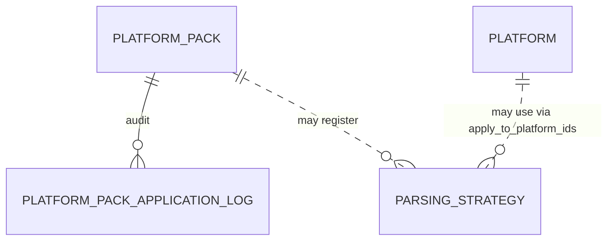

# Data Model — Platform Packs

This document is the source of truth for the platform-packs feature's
persistence layer **and** for the YAML pack format itself. It is
consumed by Alembic migration `0003_platform_packs.py` and by
SQLAlchemy 2.0 async models in `src/romarr/platform_packs/models.py`.

This feature adds **two new tables** (`parsing_strategies`,
`platform_pack_application_log`) and re-uses the existing
`platform_pack` table from the foundation. It does **not** widen the
schema for new platforms — that's the constitutional point of the
pack system.

## Entity-Relationship Additions



Both new tables carry `pack_version` and `pack_source` columns to
match the convention established in foundation. The
`apply_to_platform_ids` field is a JSON list of platform IDs to keep
the relationship deferred — a parsing strategy may reference
platforms that don't yet exist (e.g., shipped before the matching
console pack), and that is acceptable.

## Tables

### 1. `parsing_strategies`

| Column | Type | Constraints / Notes |
|---|---|---|
| `id` | TEXT | PK; e.g. `ines-header`, `switch-keys` |
| `description` | TEXT | nullable |
| `regex` | TEXT | NOT NULL; valid Python regex |
| `apply_to_platform_ids` | JSON | nullable; list of platform IDs (integers) |
| `pack_version` | TEXT | nullable |
| `pack_source` | TEXT | NOT NULL CHECK in `('builtin','community','user')` |
| `created_at` | TIMESTAMP | NOT NULL DEFAULT CURRENT_TIMESTAMP |
| `updated_at` | TIMESTAMP | NOT NULL DEFAULT CURRENT_TIMESTAMP |

Indexes: implicit on PK.

Notes:

- A pack-defined strategy with the same `id` REPLACES the existing
  row (FR-014). User-overridden strategies (`pack_source = 'user'`)
  are protected by the same rule that protects platforms — pack
  application MUST skip them.
- The strategy is just a regex template; consumers (the filename
  parser dispatcher, the header reader registry) look up by id
  through their existing platform-pack-aware tables.

### 2. `platform_pack_application_log`

Audit trail of every pack application attempt — success, skip, or
failure.

| Column | Type | Constraints / Notes |
|---|---|---|
| `id` | INTEGER | PK |
| `pack_version` | TEXT | NOT NULL; FK → `platform_pack.version` ON DELETE CASCADE |
| `action` | TEXT | NOT NULL CHECK in `('applied','reapplied','skipped','failed')` |
| `platforms_affected` | JSON | NOT NULL; list of slugs touched (added or updated) |
| `parsing_strategies_affected` | JSON | NOT NULL DEFAULT '[]'; list of strategy ids touched |
| `started_at` | TIMESTAMP | NOT NULL DEFAULT CURRENT_TIMESTAMP |
| `finished_at` | TIMESTAMP | nullable; NULL if the run never reached the end |
| `status` | TEXT | NOT NULL CHECK in `('success','failed')` |
| `error_message` | TEXT | nullable; populated on `status = 'failed'` |
| `applied_by` | TEXT | nullable; `'system'` for first-boot, otherwise an operator identifier (Auth spec wires the real value) |

Indexes:

- non-unique on `pack_version` for fast per-pack history queries.
- non-unique on `started_at DESC` for the default "most recent first" listing.

Notes:

- Failed runs persist a row even though the data side rolls back.
- This table is append-only at the application level; nothing
  mutates rows in-place.

### 3. (no new column on `platform_pack`)

The foundation `platform_pack` table already carries `version`
(unique), `source_url`, `description`, `applied_at`, `applied_by`,
and `contents_hash`. This feature only writes new rows there; no
column changes.

If a deployment somehow predates the foundation's `contents_hash`
column (it shouldn't, since foundation must be merged first), the
migration `0003_platform_packs.py` adds a defensive
`ADD COLUMN IF NOT EXISTS` for `contents_hash`.

## JSON Schema for the YAML Pack Format

This schema is the source of truth for FR-001 and is consumed by
`src/romarr/platform_packs/schema.py` via the `jsonschema` library.

```json
{
  "$schema": "https://json-schema.org/draft/2020-12/schema",
  "$id": "https://romarr.example/schemas/platform-pack-v1.json",
  "title": "Romarr Platform Pack",
  "type": "object",
  "additionalProperties": false,
  "required": ["pack_version", "schema_version", "platforms"],
  "properties": {
    "pack_version": {
      "type": "string",
      "pattern": "^[0-9]{4}\\.[0-9]{2}\\.[0-9]{3}$",
      "description": "Date-based version, YYYY.MM.NNN"
    },
    "schema_version": {
      "type": "integer",
      "minimum": 1,
      "maximum": 1
    },
    "description": { "type": "string" },
    "author": { "type": "string" },
    "source_url": { "type": "string", "format": "uri" },
    "parsing_strategies": {
      "type": "array",
      "items": { "$ref": "#/$defs/parsingStrategy" }
    },
    "platforms": {
      "type": "array",
      "minItems": 1,
      "items": { "$ref": "#/$defs/platform" }
    }
  },
  "$defs": {
    "platform": {
      "type": "object",
      "additionalProperties": false,
      "required": ["slug", "name", "manufacturer", "formats"],
      "properties": {
        "slug": {
          "type": "string",
          "pattern": "^[a-z0-9]+(-[a-z0-9]+)*$"
        },
        "name": { "type": "string", "minLength": 1 },
        "short_name": { "type": "string" },
        "manufacturer": { "type": "string" },
        "generation": { "type": "integer", "minimum": 1 },
        "release_year": { "type": "integer", "minimum": 1970, "maximum": 2100 },
        "is_handheld": { "type": "boolean" },
        "is_disc_based": { "type": "boolean" },
        "parent_platform_slug": {
          "type": ["string", "null"],
          "pattern": "^[a-z0-9]+(-[a-z0-9]+)*$"
        },
        "metadata_ids": {
          "type": "object",
          "additionalProperties": false,
          "properties": {
            "igdb_id": { "type": ["integer", "null"] },
            "screenscraper_id": { "type": ["integer", "null"] },
            "mobygames_id": { "type": ["integer", "null"] },
            "thegamesdb_id": { "type": ["integer", "null"] },
            "launchbox_id": { "type": ["string", "null"] },
            "hasheous_id": { "type": ["string", "null"] },
            "retroachievements_id": { "type": ["integer", "null"] }
          }
        },
        "icon_url": { "type": "string", "format": "uri" },
        "formats": {
          "type": "array",
          "minItems": 1,
          "items": { "$ref": "#/$defs/format" }
        },
        "naming_tokens": {
          "type": "array",
          "items": { "$ref": "#/$defs/namingToken" }
        }
      }
    },
    "format": {
      "type": "object",
      "additionalProperties": false,
      "required": ["extension", "format_type"],
      "properties": {
        "extension": {
          "type": "string",
          "pattern": "^\\.[A-Za-z0-9]+$"
        },
        "format_type": {
          "type": "string",
          "enum": ["cartridge", "disc", "compressed", "archive", "package"]
        },
        "is_primary": { "type": "boolean" },
        "is_compressed": { "type": "boolean" },
        "requires_companion": { "type": "boolean" },
        "companion_extensions": {
          "type": "array",
          "items": { "type": "string", "pattern": "^\\.[A-Za-z0-9]+$" }
        },
        "parser_strategy": { "type": "string" },
        "header_offset": { "type": "integer", "minimum": 0 },
        "header_signature_hex": {
          "type": "string",
          "pattern": "^[0-9A-Fa-f]+$"
        }
      }
    },
    "namingToken": {
      "type": "object",
      "additionalProperties": false,
      "required": ["pattern", "meaning"],
      "properties": {
        "pattern": { "type": "string", "minLength": 1 },
        "meaning": {
          "type": "string",
          "enum": ["serial", "revision", "content_type", "custom"]
        },
        "description": { "type": "string" },
        "example": { "type": "string" }
      }
    },
    "parsingStrategy": {
      "type": "object",
      "additionalProperties": false,
      "required": ["id", "regex"],
      "properties": {
        "id": {
          "type": "string",
          "pattern": "^[a-z0-9]+(-[a-z0-9]+)*$"
        },
        "description": { "type": "string" },
        "regex": { "type": "string", "minLength": 1 },
        "apply_to_platforms": {
          "type": "array",
          "items": { "type": "string", "pattern": "^[a-z0-9]+(-[a-z0-9]+)*$" }
        }
      }
    }
  }
}
```

### Cross-reference checks (beyond JSON Schema)

The validator runs these in addition to the schema check:

1. **Duplicate slug within the pack** — at most one platform per
   slug.
2. **Duplicate extension within a platform** — at most one format
   per extension under each platform.
3. **Dangling `parent_platform_slug`** — every non-null
   `parent_platform_slug` must point either to another slug in the
   pack or to a slug already present in the database.
4. **Cycles in `parent_platform_slug`** — graph must be a DAG;
   detected via DFS over the union of pack-defined slugs and
   already-persisted platforms (using only their slug → parent_slug
   edges).
5. **`schema_version` ≤ supported** — application's supported
   schema version is currently 1; greater values are rejected.
6. **`apply_to_platforms` references in `parsing_strategies`** —
   non-existent slugs produce a structured **warning**, not an
   error (the orphan is benign).

## Pydantic Schemas

In `src/romarr/platform_packs/schemas.py`:

- `ParsingStrategyRead/Create/Update`.
- `PlatformPackApplicationLogRead/Create` (no `*Update`; the audit
  log is append-only).
- `PackUploadResult` — wraps the audit-log row + the pack's
  `pack_version` and `contents_hash` and a structured diff:

```python
class PackPlatformDiff(BaseModel):
    slug: str
    action: Literal["inserted", "updated", "skipped"]
    reason: str | None     # populated when action = "skipped" (e.g., "user-overridden")
    fields_changed: list[str] = []

class PackUploadResult(BaseModel):
    pack_version: str
    contents_hash: str
    action: Literal["applied", "reapplied", "skipped", "failed"]
    diff: list[PackPlatformDiff]
    parsing_strategies_affected: list[str]
    started_at: datetime
    finished_at: datetime | None
    error_message: str | None
```

- `ValidateResult` — same shape as `PackUploadResult` but with an
  explicit `database_state_unchanged: bool = True` flag and the
  `action` constrained to `"would_apply" | "would_skip" |
  "would_fail"`.

## Migration `0003_platform_packs.py` — Summary

1. `CREATE TABLE parsing_strategies` (DDL above).
2. `CREATE TABLE platform_pack_application_log` (DDL above).
3. (Defensive) `ALTER TABLE platform_pack ADD COLUMN IF NOT EXISTS contents_hash TEXT NOT NULL DEFAULT ''` — only fires if foundation didn't ship the column.
4. No data seeding here. The built-in pack auto-applies on first
   boot via the runtime path (FR-017), not via an Alembic data
   migration. This keeps the schema migration pure-DDL and the
   first-boot path testable in isolation.

## Schema Delta — Session 2026-04-29 Clarifications

The `parsing_strategies` table is owned by this spec (003), not by spec 001
(see FR-014a). Authoritative DDL for `0003_platform_packs.py`:

```sql
CREATE TABLE parsing_strategies (
  id TEXT PRIMARY KEY,
  name TEXT NOT NULL,
  pattern TEXT NOT NULL,                          -- regex (validated at save time, FR-005a)
  apply_to_platforms JSON NOT NULL DEFAULT '[]',  -- list of platform slugs; '[]' = all
  pack_version TEXT NOT NULL,                     -- the pack that introduced this row
  created_at TIMESTAMP NOT NULL DEFAULT current_timestamp,
  updated_at TIMESTAMP NOT NULL DEFAULT current_timestamp
);
```

Pack ingestion replaces strategies on `id` collision (delete + insert) per
FR-014. Regex `pattern` values are subject to the adversarial-input
50 ms time-bound check at save time (FR-005a).
