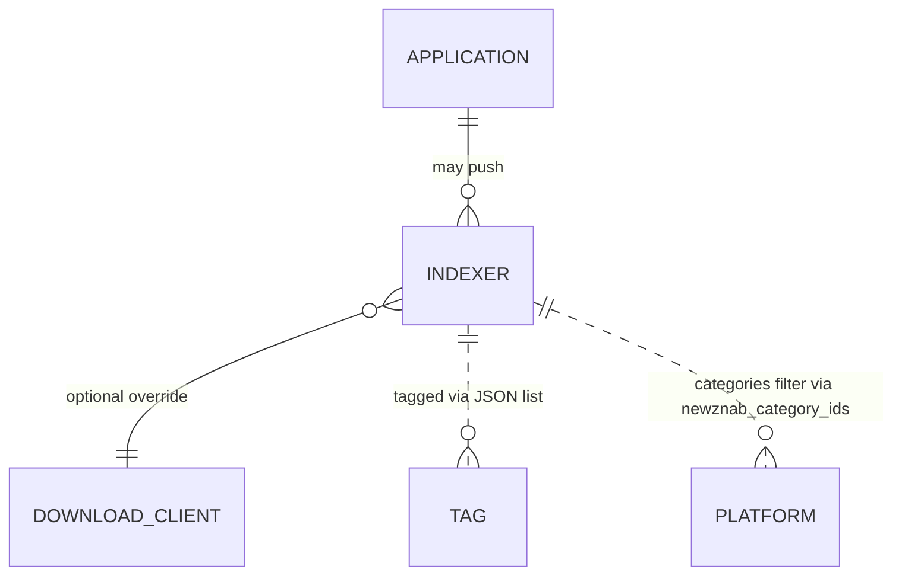

# Data Model — Indexers

This document is the source of truth for the indexer feature's
persistence layer. It is consumed by Alembic migration
`0004_indexers.py` and by SQLAlchemy 2.0 async models in
`src/romarr/indexers/models.py`. **Two new tables** are added
(`indexer`, `application`). One column is read from the existing
`platform` table (`newznab_category_ids`); that column is added by
the Platform Packs migration `0003`, not here.

## Entity-Relationship Additions



The `download_client` table is introduced by a later spec
(`005-download-clients`); the `indexer.download_client_id` column
is therefore added here as a NULL-able integer with no FK
constraint to avoid a circular dependency. The FK will be added by
the download-clients migration.

## Tables

### 1. `indexer`

Persists configured Newznab/Torznab indexers. API key encrypted at rest.

| Column | Type | Constraints / Notes |
|---|---|---|
| `id` | INTEGER | PK |
| `name` | TEXT | NOT NULL; operator-supplied label |
| `implementation` | TEXT | NOT NULL CHECK in (`newznab`, `torznab`) |
| `url` | TEXT | NOT NULL; base URL of the indexer |
| `api_key_encrypted` | BLOB | nullable; Fernet token wrapping the plain API key (re-uses `metadata.encryption`) |
| `categories` | JSON | NOT NULL DEFAULT `[]`; list of integer category IDs |
| `priority` | INTEGER | NOT NULL DEFAULT 25; lower = preferred (consumed by future Search spec) |
| `enable_rss` | BOOLEAN | NOT NULL DEFAULT true |
| `enable_automatic_search` | BOOLEAN | NOT NULL DEFAULT true |
| `enable_interactive_search` | BOOLEAN | NOT NULL DEFAULT true |
| `tags` | JSON | nullable; list of tag IDs (Tags table introduced by API spec) |
| `rate_limit_seconds` | INTEGER | NOT NULL DEFAULT 5; minimum gap between outbound calls |
| `min_seeders` | INTEGER | NOT NULL DEFAULT 1; torrent only |
| `download_client_id` | INTEGER | nullable; FK added later by download-clients migration |
| `source` | TEXT | NOT NULL CHECK in (`manual`, `prowlarr`) |
| `prowlarr_app_id` | INTEGER | nullable; FK → `application.id` ON DELETE SET NULL; populated only when `source = 'prowlarr'` |
| `seed_ratio` | NUMERIC(4,2) | nullable |
| `seed_time_minutes` | INTEGER | nullable |
| `discount_only` | BOOLEAN | NOT NULL DEFAULT false |
| `priority_indexer` | BOOLEAN | NOT NULL DEFAULT false; bumps preference in the Search spec |
| `last_health_at` | TIMESTAMP | nullable |
| `last_health_ok` | BOOLEAN | nullable |
| `last_health_error` | TEXT | nullable; structured error message when `last_health_ok = false` |
| `created_at` | TIMESTAMP | NOT NULL DEFAULT CURRENT_TIMESTAMP |
| `updated_at` | TIMESTAMP | NOT NULL DEFAULT CURRENT_TIMESTAMP |

Indexes:

- UNIQUE on `(implementation, url)` — prevents duplicate indexer
  registration (raises HTTP 409 on collision per the spec).
- non-unique on `source` for fast filtering of Prowlarr-managed
  vs manual indexers.

Invariants (Python-side validators in `indexers/schemas.py`):

- `source = 'prowlarr'` ⇒ `prowlarr_app_id IS NOT NULL`.
- `source = 'manual'` ⇒ `prowlarr_app_id IS NULL`.
- `rate_limit_seconds >= 0`.
- `priority` between 1 and 100.

### 2. `application`

Persists Prowlarr instances that have registered Romarr as a
downstream application.

| Column | Type | Constraints / Notes |
|---|---|---|
| `id` | INTEGER | PK |
| `name` | TEXT | NOT NULL; operator/Prowlarr-supplied label |
| `sync_level` | TEXT | NOT NULL CHECK in (`disabled`, `add_only`, `full_sync`) DEFAULT `'full_sync'` |
| `prowlarr_url` | TEXT | NOT NULL; base URL of the Prowlarr instance for callbacks |
| `prowlarr_api_key_encrypted` | BLOB | NOT NULL; Fernet token wrapping the API key Romarr uses to call Prowlarr |
| `app_token_hash` | TEXT | NOT NULL; bcrypt hash of the 32-byte token Prowlarr uses to call Romarr |
| `enabled` | BOOLEAN | NOT NULL DEFAULT true |
| `created_at` | TIMESTAMP | NOT NULL DEFAULT CURRENT_TIMESTAMP |
| `last_sync_at` | TIMESTAMP | nullable |

Indexes:

- UNIQUE on `prowlarr_url` — at most one Application row per
  Prowlarr instance (rejecting duplicates with HTTP 409 keeps
  bidirectional callbacks unambiguous).

Notes:

- The plaintext `app_token` is returned exactly once from
  `POST /api/v3/applications`. After that, only the bcrypt hash
  is stored. Verification on inbound calls compares the bcrypt
  hash.
- The `prowlarr_api_key_encrypted` is the credential Romarr uses
  to call **back** into Prowlarr (e.g., to delete an indexer
  Prowlarr pushed earlier). Decrypted only at call time, never
  logged.
- Deleting an Application row deletes none of its pushed
  indexers automatically — the `indexer.prowlarr_app_id` FK uses
  `ON DELETE SET NULL` so a Prowlarr de-registration converts
  pushed indexers to orphans (the operator can then remove or
  re-tie them manually).

## Existing column dependency: `platform.newznab_category_ids`

Added by the Platform Packs spec migration `0003`. Stored as a
JSON list of integer category IDs. This feature **only reads**
the column and uses it for:

1. Pre-populating the categories multi-select on the indexer
   configuration UI (UI spec consumes a future endpoint that
   joins this column).
2. Filtering search results by platform category in the future
   Search spec.

If the column is absent (e.g., Platform Packs migration not
applied), the system defaults to an empty list and the operator
configures categories manually.

## Newznab Category Reference

This is documentation, not a table. The Search spec consumes
these IDs alongside the platform-pack data. Romarr neither stores
nor enforces this list — it is reproduced here so the spec, the
plan, and the tests share a single source of truth.

| Category ID | Label |
|---|---|
| 1000 | Console (root) |
| 1010 | NDS |
| 1020 | PSP |
| 1030 | Wii / Wii WAD |
| 1040 | Xbox / Xbox 360 / XBLA |
| 1050 | PS3 / PSN |
| 1060 | Other Console |
| 1080 | 3DS |
| 1090 | PS Vita |
| 7000 | Other (root) |
| 7010 | Misc |

## Pydantic Schemas

Each new entity has the standard triplet plus a few feature-specific
shapes in `src/romarr/indexers/schemas.py`:

- `IndexerRead` — exposes everything except `api_key_encrypted`;
  carries `is_configured: bool` derived from
  `api_key_encrypted IS NOT NULL`.
- `IndexerCreate` — accepts a plaintext `api_key`; the application
  encrypts it on the way in.
- `IndexerUpdate` — fields all optional; `extra='forbid'`. If
  `api_key` is included, it is re-encrypted; if absent, the
  existing ciphertext is left untouched.
- `IndexerSchema` — describes the indexer schema returned by
  `GET /api/v3/indexer/schema` (Prowlarr expects this).

Same triplet shape for `Application`, with the explicit
guarantee that `ApplicationRead` never carries the plaintext
`app_token` (it was returned only at registration).

## Identification-side Reuse

This feature does NOT introduce new value types beyond what's in
`indexers/types.py`:

```python
class FieldProvenance(StrEnum):
    TORZNAB = "torznab"   # standard torznab:attr namespace
    GRABARR = "grabarr"   # extended grabarr:* namespace
    FILENAME = "filename" # foundation filename parser fallback

class ParsedTorznabAttr(BaseModel):
    name: str
    value: str
    provenance: FieldProvenance

class IndexerCapabilities(BaseModel):
    server: str | None
    searching: dict[str, dict]   # {searchType: {available: bool, supportedParams: [...]}}
    categories: list[int]
    extended_attrs_supported: list[str]   # informational

class SearchResult(BaseModel):
    indexer_id: int
    guid: str
    title: str
    link: str
    size_bytes: int | None
    seeders: int | None
    peers: int | None
    files: int | None
    info_hash: str | None
    magnet_url: str | None
    categories: list[int]
    publish_date: datetime | None
    # extended fields with provenance
    region: str | None
    region_provenance: FieldProvenance | None
    languages: list[str]
    languages_provenance: FieldProvenance | None
    revision: str | None
    revision_provenance: FieldProvenance | None
    dump_tags: list[str]
    dump_tags_provenance: FieldProvenance | None
    hash_sha1: str | None
    hash_sha1_provenance: FieldProvenance | None
    hash_crc32: str | None
    hash_crc32_provenance: FieldProvenance | None
    naming_convention: NamingConvention | None     # foundation enum
    naming_convention_provenance: FieldProvenance | None
    dat_source: DatSource | None                    # foundation enum
    dat_source_provenance: FieldProvenance | None

class RssResult(BaseModel):
    indexer_id: int
    items: list[SearchResult]
    fetched_at: datetime
    elapsed_ms: int

class IndexerHealthIssue(BaseModel):
    indexer_id: int
    indexer_name: str
    category: Literal["protocol", "auth", "rate_limit", "circuit_open", "connectivity", "parser"]
    message: str
    occurred_at: datetime
```

These types are pure-Python, never persisted, and consumed by both
the future Search spec and the future Health/Notifications spec.

## Migration `0004_indexers.py` — Summary

1. `CREATE TABLE indexer` (DDL above) with the unique
   `(implementation, url)` index.
2. `CREATE TABLE application` (DDL above) with the unique
   `prowlarr_url` index.
3. No data seeding — indexers are added by operators or by Prowlarr
   registration; this migration only provides the schema.
4. The `indexer.download_client_id` column is created with no FK
   constraint; the download-clients migration (later spec) adds
   the FK once that table exists.

## Schema Delta — Session 2026-04-29 Clarifications

Append two columns to `indexer`:

```sql
ALTER TABLE indexer
  ADD COLUMN timeout_seconds INTEGER NOT NULL DEFAULT 30 CHECK (timeout_seconds BETWEEN 5 AND 120),
  ADD COLUMN result_limit INTEGER NOT NULL DEFAULT 100 CHECK (result_limit BETWEEN 1 AND 500);
```

`timeout_seconds` bounds every outbound `t=caps` / `t=search` / `t=rss`
call (FR-009a); timeouts trip the per-indexer circuit breaker.
`result_limit` is passed as `limit=…` to indexers whose `t=caps`
advertises pagination, and otherwise enforced post-parse via truncation
(FR-026a).
