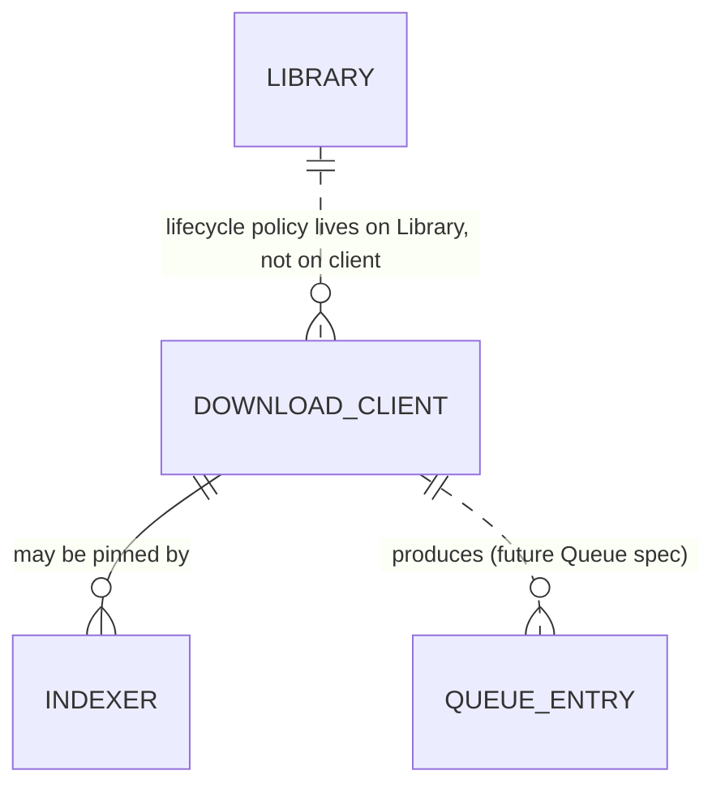

# Data Model — Download Clients

This document is the source of truth for the download-clients
feature's persistence layer. It is consumed by Alembic migration
`0005_download_clients.py` and by SQLAlchemy 2.0 async models in
`src/romarr/downloaders/models.py`.

This feature adds **one new table** (`download_client`) and
**finally adds the FK constraint** to the existing
`indexer.download_client_id` column that was created columnless in
the indexers migration (`0004`).

## Entity-Relationship Additions



Note: the `library` table and the lifecycle policy live in the
foundation; this feature reads `Library.lifecycle_policy` indirectly
through the future Importer spec but does not modify it. The
`queue_entry` table is owned by the API spec — referenced here only
to clarify where the stuck-grab retry persists state.

## Tables

### 1. `download_client`

Persists configured download client connections. Credentials
encrypted at rest.

| Column | Type | Constraints / Notes |
|---|---|---|
| `id` | INTEGER | PK |
| `name` | TEXT | NOT NULL; operator-supplied label (e.g., "Local qBit", "Seedbox") |
| `type` | TEXT | NOT NULL CHECK in (`qbittorrent`, `sabnzbd`, `transmission`, `deluge`, `nzbget`) |
| `host` | TEXT | NOT NULL |
| `port` | INTEGER | NOT NULL CHECK between 1 and 65535 |
| `use_ssl` | BOOLEAN | NOT NULL DEFAULT false |
| `url_base` | TEXT | nullable; the URL path prefix (e.g., `/qbittorrent`); defaults to empty string |
| `username` | TEXT | nullable; required for qBittorrent, must be NULL for SABnzbd |
| `password_encrypted` | BLOB | nullable; Fernet token wrapping plaintext; required for qBittorrent, must be NULL for SABnzbd |
| `api_key_encrypted` | BLOB | nullable; required for SABnzbd; NULL for qBittorrent |
| `category_default` | TEXT | NOT NULL DEFAULT `'romarr'`; used as the per-grab category |
| `tags` | JSON | nullable; static tags applied on top of the standard `romarr` / `romarr-{platform-slug}` set |
| `priority` | INTEGER | NOT NULL DEFAULT 1; lower = preferred during routing |
| `enable_for_torrents` | BOOLEAN | NOT NULL DEFAULT false |
| `enable_for_usenet` | BOOLEAN | NOT NULL DEFAULT false |
| `enabled` | BOOLEAN | NOT NULL DEFAULT true |
| `remove_completed_downloads` | BOOLEAN | NOT NULL DEFAULT false; consumed by the Importer's `move_and_remove` lifecycle |
| `remove_failed_downloads` | BOOLEAN | NOT NULL DEFAULT true |
| `ssl_cert_validation` | TEXT | NOT NULL CHECK in (`enabled`, `disabled`, `disabled-for-local`) DEFAULT `'enabled'` |
| `last_health_at` | TIMESTAMP | nullable |
| `last_health_ok` | BOOLEAN | nullable |
| `last_health_error` | TEXT | nullable |
| `client_version_seen` | TEXT | nullable; populated on a successful test (e.g., `"qBittorrent v4.6.5"`) |
| `created_at` | TIMESTAMP | NOT NULL DEFAULT CURRENT_TIMESTAMP |
| `updated_at` | TIMESTAMP | NOT NULL DEFAULT CURRENT_TIMESTAMP |

Indexes:

- UNIQUE on `(type, host, port)` — prevents duplicate registration
  (returns HTTP 409 on collision per FR-025).
- non-unique on `enabled` for fast filtering during routing.

Invariants (Python-side validators in `downloaders/schemas.py`):

- `enable_for_torrents OR enable_for_usenet` MUST be true (FR-023).
- `type = 'qbittorrent'` ⇒ `username IS NOT NULL AND password_encrypted IS NOT NULL AND api_key_encrypted IS NULL`.
- `type = 'sabnzbd'` ⇒ `username IS NULL AND password_encrypted IS NULL AND api_key_encrypted IS NOT NULL`.
- `priority >= 1` AND `priority <= 100`.

### 2. `indexer.download_client_id` — FK constraint added

The `indexer.download_client_id` integer column already exists
(created by migration `0004_indexers.py` without a FK). This
migration adds the FK:

```text
ALTER TABLE indexer
  ADD CONSTRAINT fk_indexer_download_client_id
  FOREIGN KEY (download_client_id)
  REFERENCES download_client(id)
  ON DELETE SET NULL;
```

`ON DELETE SET NULL` is intentional: if an operator deletes a pinned
client, the affected indexer falls back to priority-based routing
rather than blocking the operation.

## Routing Value Types

These live in `src/romarr/downloaders/types.py` and are NOT
persisted. They are consumed by the future search/grab engine and
by the API.

```python
class ClientType(StrEnum):
    QBITTORRENT = "qbittorrent"
    SABNZBD = "sabnzbd"
    TRANSMISSION = "transmission"  # stub
    DELUGE = "deluge"              # stub
    NZBGET = "nzbget"              # stub

class SourceKind(StrEnum):
    TORRENT = "torrent"   # magnet, .torrent URL, .torrent bytes
    USENET = "usenet"     # .nzb URL, .nzb bytes

# Discriminated unions for source payloads (Pydantic v2)

class TorrentUrl(BaseModel):
    kind: Literal["torrent_url"] = "torrent_url"
    url: HttpUrl

class TorrentMagnet(BaseModel):
    kind: Literal["torrent_magnet"] = "torrent_magnet"
    magnet_uri: str

class TorrentBytes(BaseModel):
    kind: Literal["torrent_bytes"] = "torrent_bytes"
    data: bytes

TorrentSource = Annotated[
    TorrentUrl | TorrentMagnet | TorrentBytes,
    Field(discriminator="kind"),
]

class NzbUrl(BaseModel):
    kind: Literal["nzb_url"] = "nzb_url"
    url: HttpUrl

class NzbBytes(BaseModel):
    kind: Literal["nzb_bytes"] = "nzb_bytes"
    data: bytes

NzbSource = Annotated[
    NzbUrl | NzbBytes,
    Field(discriminator="kind"),
]

# Status snapshot (canonical across all client types)

class DownloadState(StrEnum):
    QUEUED = "queued"
    DOWNLOADING = "downloading"
    PAUSED = "paused"
    COMPLETED = "completed"
    SEEDING = "seeding"          # torrent only
    STALLED = "stalled"
    FAILED = "failed"

class DownloadStatus(BaseModel):
    client_id: int
    client_native_id: str         # qBit info-hash, SAB nzo_id, etc.
    name: str                      # release name as known to the client
    state: DownloadState
    progress: float                # 0.0 .. 1.0
    eta_seconds: int | None
    seeders: int | None            # torrent only
    peers: int | None              # torrent only
    download_rate_bps: int | None
    upload_rate_bps: int | None
    save_path: str | None
    completed_paths: list[str] = []  # populated when state == COMPLETED
    fetched_at: datetime

# Connectivity test result

class ConnectivityWarning(BaseModel):
    code: Literal["category_missing", "version_old", "tls_disabled_for_local"]
    message: str

class ConnectivityTestResult(BaseModel):
    ok: bool
    error_code: Literal["connection", "auth", "tls", "version", "internal", None] = None
    error_message: str | None = None
    client_version: str | None = None
    warnings: list[ConnectivityWarning] = []

# Routing decision

class RoutingDecision(BaseModel):
    chosen_client_id: int | None
    chosen_via: Literal["indexer_override", "priority", "no_eligible_client"]
    source_kind: SourceKind
    candidates_considered: list[int]   # ids of clients evaluated
    rejection_reason: str | None       # populated only when chosen_client_id is None
```

## Pydantic Schemas (persisted entities)

Each entity has the standard triplet plus a few feature-specific
shapes in `src/romarr/downloaders/schemas.py`:

- `DownloadClientRead` — exposes everything except
  `password_encrypted` and `api_key_encrypted`; carries
  `is_configured: bool` derived from the credential blobs.
- `DownloadClientCreate` — accepts plaintext `password` (qBit) or
  `api_key` (SAB); the application encrypts on the way in.
- `DownloadClientUpdate` — all fields optional;
  `extra = 'forbid'`. If `password` / `api_key` is included, the
  blob is re-encrypted; if absent, the existing ciphertext is
  preserved.
- `DownloadClientSchema` — describes one implementation's config
  fields for the future `GET /api/v3/downloadclient/schema`
  endpoint (used by the UI to render the right form).

## Migration `0005_download_clients.py` — Summary

1. `CREATE TABLE download_client` (DDL above) with the
   `(type, host, port)` uniqueness.
2. `ALTER TABLE indexer ADD CONSTRAINT fk_indexer_download_client_id
   FOREIGN KEY (download_client_id) REFERENCES download_client(id)
   ON DELETE SET NULL`.
3. No data seeding — clients are operator-configured. The
   migration's downgrade path drops the FK first, then drops the
   table.

### Notes on the deferred FK

SQLite supports FK addition through table reconstruction; Alembic
handles this via a batch operation:

```python
with op.batch_alter_table("indexer") as batch_op:
    batch_op.create_foreign_key(
        "fk_indexer_download_client_id",
        "download_client",
        ["download_client_id"],
        ["id"],
        ondelete="SET NULL",
    )
```

PostgreSQL handles the addition natively via `ALTER TABLE`. Both
paths are tested by the migration's CI matrix.
