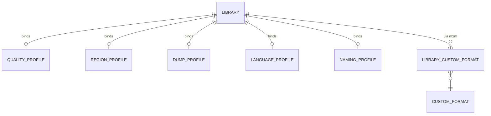

# Data Model — Profiles

This document is the source of truth for the profiles feature's
persistence layer. It is consumed by Alembic migration
`0006_profiles.py` and by SQLAlchemy 2.0 async models in
`src/romarr/profiles/models.py`. **Six new tables** plus one
many-to-many association are added.

## Entity-Relationship Additions



The `library` table itself is owned by a future spec; this feature
does NOT create it. The five FK columns
(`quality_profile_id`, `region_profile_id`, `dump_profile_id`,
`language_profile_id`, `naming_profile_id`) are added by this
feature's migration via an idempotent `ADD COLUMN IF NOT EXISTS`
guarded by an existence check on the table — i.e., the migration
adds them only if a `library` table already exists. If `library`
does not exist yet, the future Library spec migration adds the
columns directly.

## Tables

### 1. `quality_profile`

| Column | Type | Constraints / Notes |
|---|---|---|
| `id` | INTEGER | PK |
| `name` | TEXT | UNIQUE NOT NULL |
| `allowed_formats` | JSON | NOT NULL DEFAULT `[]`; list of strings (e.g., `['raw','zip','7z','chd','rvz','nkit']`) |
| `preferred_format` | TEXT | NOT NULL |
| `require_dat_verified` | BOOLEAN | NOT NULL DEFAULT false |
| `allow_archive_double_compression` | BOOLEAN | NOT NULL DEFAULT false |
| `upgrade_until_format` | TEXT | NOT NULL |
| `is_factory_default` | BOOLEAN | NOT NULL DEFAULT false (FR-003 sentinel) |
| `created_at` | TIMESTAMP | NOT NULL DEFAULT CURRENT_TIMESTAMP |
| `updated_at` | TIMESTAMP | NOT NULL DEFAULT CURRENT_TIMESTAMP |

Validators (Pydantic):

- `len(allowed_formats) >= 1` (edge case in spec).
- `preferred_format ∈ allowed_formats`.
- `upgrade_until_format ∈ allowed_formats`.

### 2. `region_profile`

| Column | Type | Constraints / Notes |
|---|---|---|
| `id` | INTEGER | PK |
| `name` | TEXT | UNIQUE NOT NULL |
| `priorities` | JSON | NOT NULL DEFAULT `[]`; ordered list of region codes |
| `allow_fallback_outside_priorities` | BOOLEAN | NOT NULL DEFAULT true |
| `exclude_regions` | JSON | NOT NULL DEFAULT `[]` |
| `is_factory_default` | BOOLEAN | NOT NULL DEFAULT false |
| `created_at`, `updated_at` | TIMESTAMP | as above |

Validators:

- `len(priorities) >= 1` OR `allow_fallback_outside_priorities = true`
  (otherwise the profile rejects every release — edge case in spec).
- No region code may appear in both `priorities` and
  `exclude_regions`.

### 3. `dump_profile`

| Column | Type | Constraints / Notes |
|---|---|---|
| `id` | INTEGER | PK |
| `name` | TEXT | UNIQUE NOT NULL |
| `allowed_dump_status` | JSON | NOT NULL DEFAULT `["verified"]`; list of `DumpStatus` values |
| `allow_proto_beta` | BOOLEAN | NOT NULL DEFAULT false |
| `allow_hacks` | BOOLEAN | NOT NULL DEFAULT false |
| `allow_trainers` | BOOLEAN | NOT NULL DEFAULT false |
| `allow_translations` | BOOLEAN | NOT NULL DEFAULT false |
| `prefer_revision` | TEXT | NOT NULL CHECK in (`latest`, `first`, `any`) DEFAULT `'latest'` |
| `is_factory_default` | BOOLEAN | NOT NULL DEFAULT false |
| `created_at`, `updated_at` | TIMESTAMP | as above |

### 4. `language_profile`

| Column | Type | Constraints / Notes |
|---|---|---|
| `id` | INTEGER | PK |
| `name` | TEXT | UNIQUE NOT NULL |
| `required_languages` | JSON | NOT NULL DEFAULT `[]`; any-of list of ISO-639-1 codes |
| `preferred_languages` | JSON | NOT NULL DEFAULT `[]`; ordered list |
| `exclude_japanese_only` | BOOLEAN | NOT NULL DEFAULT true |
| `is_factory_default` | BOOLEAN | NOT NULL DEFAULT false |
| `created_at`, `updated_at` | TIMESTAMP | as above |

Validators:

- Languages must be valid ISO-639-1 codes (re-uses foundation
  validator).

### 5. `naming_profile`

| Column | Type | Constraints / Notes |
|---|---|---|
| `id` | INTEGER | PK |
| `name` | TEXT | UNIQUE NOT NULL |
| `convention` | TEXT | NOT NULL CHECK in (`no-intro`, `redump`, `tosec`, `es-de`, `romm`, `custom`) |
| `template` | TEXT | NOT NULL; the Jinja-style template body |
| `platform_subfolder` | BOOLEAN | NOT NULL DEFAULT true |
| `replace_illegal_chars` | BOOLEAN | NOT NULL DEFAULT true |
| `multi_disc_subfolder` | BOOLEAN | NOT NULL DEFAULT true |
| `is_factory_default` | BOOLEAN | NOT NULL DEFAULT false |
| `created_at`, `updated_at` | TIMESTAMP | as above |

Validators:

- When `convention != 'custom'`, the `template` field MUST equal
  the documented template for that convention. The seeder writes
  the canonical templates verbatim.
- The `template` is parsed by the sandboxed Jinja env at save
  time; syntax errors and unknown tokens raise structured errors
  (FR-028).

### 6. `custom_format`

| Column | Type | Constraints / Notes |
|---|---|---|
| `id` | INTEGER | PK |
| `name` | TEXT | UNIQUE NOT NULL |
| `score` | INTEGER | NOT NULL; CHECK between -10000 and 10000 |
| `conditions` | JSON | NOT NULL; non-empty list of condition dicts |
| `is_factory_default` | BOOLEAN | NOT NULL DEFAULT false |
| `created_at`, `updated_at` | TIMESTAMP | as above |

Each condition dict shape (FR-020, FR-021):

```text
{
  "field": "tags" | "region" | "format" | "dump_status" | "release_group"
         | "indexer_source" | "languages" | "revision"
         | "naming_convention" | "release_size",
  "operator": "matches_regex" | "equals" | "in" | "contains"
            | "not_in" | "greater_than" | "less_than",
  "values": <list[str|number] | str | number>,
  "or": <list[<condition dict>]>?    # optional alternates
}
```

Validators:

- Every `matches_regex` regex MUST compile successfully at save
  time (FR-023).
- `len(conditions) >= 1`.
- Operator/field compatibility is enforced (e.g.,
  `greater_than`/`less_than` only with `release_size` field).

### 7. `library_custom_format` (m2m)

| Column | Type | Constraints / Notes |
|---|---|---|
| `library_id` | INTEGER | NOT NULL; FK → `library.id` ON DELETE CASCADE |
| `custom_format_id` | INTEGER | NOT NULL; FK → `custom_format.id` ON DELETE CASCADE |
| `created_at` | TIMESTAMP | NOT NULL DEFAULT CURRENT_TIMESTAMP |

Constraints:

- Composite PK on `(library_id, custom_format_id)` — prevents
  duplicate associations (edge case in spec).

Notes:

- `ON DELETE CASCADE` on both sides: deleting a Library cleans up
  its m2m rows; deleting a Custom Format also cleans them up. The
  protective HTTP 409 (FR-032) applies only to the **five
  single-FK profile types** (Quality / Region / Dump / Language /
  Naming) — those columns use `ON DELETE SET NULL` instead and the
  application enforces the 409 protection at API level.

## Library FK columns added (idempotent)

If `library` already exists (e.g., the future Library spec landed
first), the migration adds:

```text
ALTER TABLE library ADD COLUMN IF NOT EXISTS quality_profile_id  INTEGER REFERENCES quality_profile(id)  ON DELETE SET NULL;
ALTER TABLE library ADD COLUMN IF NOT EXISTS region_profile_id   INTEGER REFERENCES region_profile(id)   ON DELETE SET NULL;
ALTER TABLE library ADD COLUMN IF NOT EXISTS dump_profile_id     INTEGER REFERENCES dump_profile(id)     ON DELETE SET NULL;
ALTER TABLE library ADD COLUMN IF NOT EXISTS language_profile_id INTEGER REFERENCES language_profile(id) ON DELETE SET NULL;
ALTER TABLE library ADD COLUMN IF NOT EXISTS naming_profile_id   INTEGER REFERENCES naming_profile(id)   ON DELETE SET NULL;
```

If `library` does not exist yet, those columns are introduced by
the Library spec's own migration. Either ordering works.

## Default Seed Catalogue

The seeder reads JSON files from
`src/romarr/profiles/seeders/*.json`. The shapes are mirrors of the
table schemas. Everything below is loaded by the runner on first
boot (FR-002, FR-003, SC-001).

### Quality (3)

| name | allowed_formats | preferred_format | require_dat_verified | upgrade_until_format |
|---|---|---|---|---|
| Preservation | `[raw, zip, 7z]` | `7z` | true | `7z` |
| Emulation Optimized | `[raw, zip, chd, rvz]` | `chd` | false | `chd` |
| Disk Saver | `[7z, chd, rvz, nkit]` | `chd` | false | `chd` |

### Region (3)

| name | priorities | fallback | exclude |
|---|---|---|---|
| USA First | `[USA, EUR, World, JPN]` | true | `[]` |
| EUR First (FR) | `[EUR, World, USA, JPN]` | true | `[KOR, CHN]` |
| JPN Only | `[JPN]` | false | `[KOR, CHN]` |

### Dump (3)

| name | allowed_dump_status | proto/beta | hacks | trainers | translations | prefer_revision |
|---|---|---|---|---|---|---|
| Preservation Strict | `[verified]` | false | false | false | false | latest |
| Permissive | `[verified, good]` | false | false | false | true | latest |
| Romhacks Welcome | `[verified, good, hack]` | true | true | true | true | any |

### Language (3)

| name | required | preferred | exclude_japanese_only |
|---|---|---|---|
| FR or EN | `[fr, en]` (any-of) | `[fr, en]` | true |
| EN Only | `[en]` | `[en, multi]` | true |
| Any Language | `[]` | `[en, fr]` | false |

### Naming (3)

Templates per convention (FR-024 mandates these are the canonical
templates the engine ships):

| convention | template |
|---|---|
| `no-intro` | `{Game.Title} ({Release.Region})[ ({Release.Languages})][ ({Release.Revision})][ [{Release.Tags}]].{Dump.Extension}` |
| `redump` | `{Game.Title} ({Release.Region}).{Dump.Extension}` |
| `tosec` | `{Game.Title} ({Game.Year})({Game.Publisher})({Release.Region}).{Dump.Extension}` |
| `es-de` | `{Platform.Slug}/{Game.SortTitle} - {Release.Region}.{Dump.Extension}` |
| `romm` | `{Platform.Slug}/{Release.OriginalName}` |

Profiles seeded:

| name | convention | platform_subfolder | replace_illegal | multi_disc_subfolder |
|---|---|---|---|---|
| No-Intro Standard | no-intro | true | true | true |
| ES-DE Compatible | es-de | true | true | true |
| RomM Passthrough | romm | true | true | false |

### Custom Formats (11)

| name | score | conditions (summary) |
|---|---|---|
| Verified Dump | +100 | `tags matches_regex "\[!\]"` |
| Hack | -10000 | `tags matches_regex "\[h\d?\]" OR dump_status equals "hack"` |
| Trainer | -10000 | `tags matches_regex "\[t\d?\]" OR dump_status equals "trainer"` |
| Bad Dump | -10000 | `tags matches_regex "\[b\]" OR dump_status equals "baddump"` |
| Overdump | -10000 | `tags matches_regex "\[o\]" OR dump_status equals "overdump"` |
| FR Translation | +50 | `tags matches_regex "\[T\+Fr\]"` |
| EN Translation | +30 | `tags matches_regex "\[T\+En\]"` |
| Original Release (Rev 0) | +20 | `revision in_list ["", "Rev 0", "Rev 00"]` |
| Latest Revision | +30 | `revision matches_regex "Rev [B-Z]"` |
| Multi-Region | +15 | `region in_list ["World", "World+EUR"]` |
| No-Intro Convention | +10 | `naming_convention equals "no-intro"` |

### Scene Groups list

A small JSON file at
`src/romarr/profiles/seeders/scene_groups.json` lists common ROM
scene release-group identifiers (e.g., `DEMENT`, `iND`, `RFTD`).
The foundation's filename parser dispatcher uses this list to
extract the `release_group` field for the Custom Format scoring
condition. Operators may extend the list via a config override
documented in the README.

## Pydantic Schemas

Each entity has the standard `*Read/*Create/*Update` triplet in
`src/romarr/profiles/schemas.py`. Notable feature-specific shapes:

```python
class Decision(StrEnum):
    ACCEPT = "accept"
    REJECT = "reject"
    NEUTRAL = "neutral"

class EvaluationReason(BaseModel):
    field: str | None        # field that drove the decision
    code: str                # machine-readable reason (e.g. "format_not_allowed")
    message: str             # human-readable, no localisation here

class EvaluationResult(BaseModel):
    decision: Decision
    reason: EvaluationReason | None = None
    score: int = 0           # populated by Region eval (rank) and Custom Format eval (sum)

class NamingPreviewRequest(BaseModel):
    profile: NamingProfileCreate     # candidate shape, may not exist in DB yet
    sample_release_id: int

class NamingPreviewResponse(BaseModel):
    rendered: str

class ForceDeleteResult(BaseModel):
    deleted: bool
    affected_libraries: list[int]    # library ids whose FK was set to NULL
```

## Migration `0006_profiles.py` — Summary

1. `CREATE TABLE quality_profile / region_profile / dump_profile /
   language_profile / naming_profile / custom_format` per the DDL
   above, each with `is_factory_default` boolean and the standard
   timestamps.
2. `CREATE TABLE library_custom_format` (m2m) with the composite
   PK and the two CASCADE FKs.
3. Idempotent `ADD COLUMN IF NOT EXISTS` for the five
   `library.<type>_profile_id` FKs (only fires if `library` exists).
4. No data seeding here. The default-profile catalogue is applied
   at runtime by the seeder on first boot (FR-002), so the JSON
   defaults can evolve across releases without a schema migration.

## Schema Delta — Session 2026-04-29 Clarifications

### Two columns added to every profile table

For each of: `quality_profile`, `region_profile`, `dump_profile`,
`language_profile`, `naming_profile`, `custom_format`:

```sql
ALTER TABLE <profile_table>
  ADD COLUMN seed_key VARCHAR NULL,
  ADD COLUMN is_user_modified BOOLEAN NOT NULL DEFAULT false;

CREATE UNIQUE INDEX idx_<profile_table>_seed_key
  ON <profile_table> (seed_key)
  WHERE seed_key IS NOT NULL;
```

Per FR-003a: the seeder identifies its own rows via `seed_key`. UPDATE
through any API endpoint flips `is_user_modified` to `true` in the same
transaction. The seeder upserts only when `is_user_modified = false`.

### Library FK columns NOT added by this spec

Per FR-004 (rewritten): the five Library → Profile FKs and the m2m's
`library_id` FK are added by spec 009's migration, not this one. This
spec creates `library_custom_format` with `custom_format_id` only;
spec 009 adds `library_id` and the unique constraint
`(library_id, custom_format_id)`.
