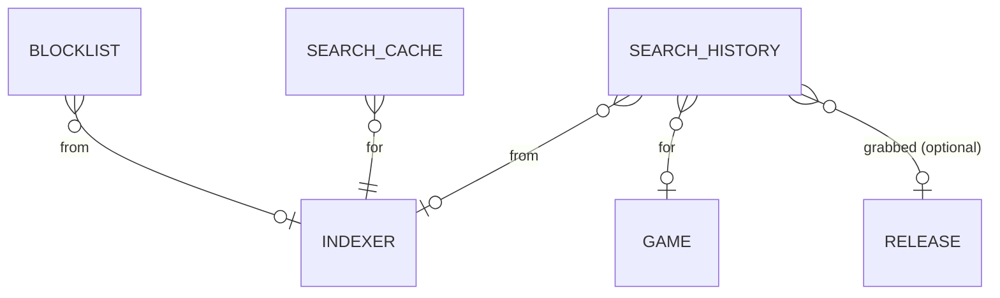

# Data Model — Search & Grab Decision Engine

This document is the source of truth for the search feature's
persistence layer. It is consumed by Alembic migration
`0007_search.py` and by SQLAlchemy 2.0 async models in
`src/romarr/search/models.py`. **Three new tables** plus one
column addition on the existing `indexer` table.

## Entity-Relationship Additions



All three new tables have nullable indexer FKs because indexer rows
may be deleted during the lifecycle of an audit row; ON DELETE
SET NULL on the indexer FK keeps the audit history intact.

## Tables

### 1. `blocklist`

Suppresses known-bad releases from being grabbed again.

| Column | Type | Constraints / Notes |
|---|---|---|
| `id` | INTEGER | PK |
| `indexer_id` | INTEGER | nullable; FK → `indexer.id` ON DELETE SET NULL |
| `indexer_guid` | TEXT | nullable; the indexer's release ID |
| `release_title` | TEXT | NOT NULL |
| `hash_sha1` | TEXT | nullable; lowercase hex 40 chars |
| `hash_crc32` | TEXT | nullable; lowercase hex 8 chars |
| `reason` | TEXT | NOT NULL; structured reason (e.g., `import-failed:hash-mismatch`) |
| `added_by` | TEXT | NOT NULL DEFAULT `'system'`; `'system'` for auto-add, otherwise an operator id (Auth spec wires the real value) |
| `added_at` | TIMESTAMP | NOT NULL DEFAULT CURRENT_TIMESTAMP |

Indexes:

- non-unique on `(indexer_id, indexer_guid)` for pipeline lookup.
- non-unique on `hash_sha1` and `hash_crc32` for hash-based
  lookup.
- non-unique on `added_at DESC` for the default UI list.

Invariants (Pydantic):

- At least one of `(indexer_id, indexer_guid)` AND `hash_sha1` AND
  `hash_crc32` MUST be populated; an entry with none of these
  rejects nothing and is therefore meaningless. The validator
  rejects such entries at save time.

### 2. `search_history`

Audit trail of every search round, success or failure.

| Column | Type | Constraints / Notes |
|---|---|---|
| `id` | INTEGER | PK |
| `search_type` | TEXT | NOT NULL CHECK in (`manual`, `auto_added`, `missing_scheduled`, `cutoff_scheduled`, `rss`) |
| `query` | TEXT | nullable (RSS sync has no query) |
| `indexer_id` | INTEGER | nullable; FK → `indexer.id` ON DELETE SET NULL |
| `game_id` | INTEGER | nullable; FK → `game.id` ON DELETE SET NULL |
| `release_id` | INTEGER | nullable; FK → `release.id` ON DELETE SET NULL; populated only when targeting a specific Release |
| `results_count` | INTEGER | NOT NULL DEFAULT 0 |
| `grabbed_release_id` | INTEGER | nullable; FK → `release.id` ON DELETE SET NULL; populated when a grab fired |
| `chosen_indexer_guid` | TEXT | nullable; the GUID of the grabbed result |
| `score` | INTEGER | nullable; the winning score |
| `no_grab_reason` | TEXT | nullable; structured reason when no grab fired (e.g., `no_results`, `all_indexers_failed`, `score_below_threshold`) |
| `score_breakdown` | JSON | nullable; ranked top-10 candidates' breakdowns for the UI history view |
| `started_at` | TIMESTAMP | NOT NULL DEFAULT CURRENT_TIMESTAMP |
| `finished_at` | TIMESTAMP | nullable; NULL when the round was interrupted |
| `duration_ms` | INTEGER | nullable |
| `correlation_id` | TEXT | NOT NULL; UUIDv4 grouping all rows from the same parent round (one missing-search batch produces N rows sharing one correlation id) |

Indexes:

- non-unique on `started_at DESC` for the default list.
- non-unique on `(game_id, started_at DESC)` for the per-Game view.
- non-unique on `(search_type, started_at DESC)` for the
  "all RSS sync runs in last 7 days" view.
- non-unique on `correlation_id` for the parent-round join.

### 3. `search_cache`

Caches indexer responses for non-RSS modes.

| Column | Type | Constraints / Notes |
|---|---|---|
| `id` | INTEGER | PK |
| `indexer_id` | INTEGER | NOT NULL; FK → `indexer.id` ON DELETE CASCADE (orphaned rows are noise; cascade keeps the table clean) |
| `cache_key` | TEXT | NOT NULL; SHA-256 hex of `(query, frozenset(category_ids))` |
| `query` | TEXT | NOT NULL; the original query (preserved for diagnostics) |
| `category_ids` | JSON | NOT NULL; list of integer category IDs |
| `response_xml` | BLOB | NOT NULL; the raw indexer response body (gzipped) |
| `parsed_results` | JSON | NOT NULL; the canonical `SearchResult` list as JSON for fast deserialisation |
| `fetched_at` | TIMESTAMP | NOT NULL DEFAULT CURRENT_TIMESTAMP |
| `expires_at` | TIMESTAMP | NOT NULL; `fetched_at + indexer.cache_ttl_seconds` (default 3600) |

Indexes:

- UNIQUE on `(indexer_id, cache_key)` — prevents duplicate cache
  rows for the same effective query.
- non-unique on `expires_at` to support the future cleanup task.

Notes:

- The `response_xml` blob is preserved so a future operator-tooling
  spec can replay an indexer response without hitting the live
  service.
- RSS sync **never** writes to this table (FR-027).

## Modification — `indexer.rss_auto_grab`

A single boolean column added by this feature's migration:

| Column | Type | Constraints / Notes |
|---|---|---|
| `rss_auto_grab` | BOOLEAN | NOT NULL DEFAULT true |

When `false`, RSS results from this indexer are recorded in
`search_history` but never auto-grabbed regardless of score
(US7 third scenario).

The migration uses `ADD COLUMN IF NOT EXISTS` so re-running the
migration in a development loop is safe.

## Score Breakdown Value Type (not persisted)

This shape lives in `src/romarr/search/types.py` and is consumed
by the API responses, the UI history view, and the score-breakdown
column in `search_history`. It is the **explanation** behind every
candidate's score.

```python
class RejectionCode(StrEnum):
    NO_GAME_MATCH = "no_game_match"
    REGION_EXCLUDED = "region_excluded"
    REGION_OUT_OF_PRIORITIES = "region_out_of_priorities"
    LANGUAGE_REQUIRED = "language_required"
    JAPANESE_ONLY_EXCLUDED = "japanese_only_excluded"
    DUMP_STATUS_DISALLOWED = "dump_status_disallowed"
    HACK_DISALLOWED = "hack_disallowed"
    TRAINER_DISALLOWED = "trainer_disallowed"
    TRANSLATION_DISALLOWED = "translation_disallowed"
    PROTO_BETA_DISALLOWED = "proto_beta_disallowed"
    FORMAT_NOT_ALLOWED = "format_not_allowed"
    DAT_REQUIRED = "dat_required"
    CUSTOM_FORMAT_REJECT = "custom_format_reject"
    BLOCKLISTED_GUID = "blocklisted_guid"
    BLOCKLISTED_HASH = "blocklisted_hash"
    SIZE_OUT_OF_BOUNDS = "size_out_of_bounds"
    SEEDERS_BELOW_THRESHOLD = "seeders_below_threshold"

class Rejection(BaseModel):
    code: RejectionCode
    field: str | None
    message: str

class ScoreContribution(BaseModel):
    source: Literal["region", "language", "custom_format", "dat_match", "size_bonus"]
    name: str         # e.g. "USA First", "Verified Dump", "DAT match"
    value: int

class ScoreBreakdown(BaseModel):
    total: int
    contributions: list[ScoreContribution]

class Candidate(BaseModel):
    indexer_id: int
    indexer_guid: str
    title: str
    download_url: str
    size_bytes: int | None
    seeders: int | None
    matched_game_id: int | None
    matched_release_id: int | None
    score_breakdown: ScoreBreakdown | None       # populated only when not rejected
    rejection: Rejection | None                  # populated only when rejected
    would_auto_reject: bool                      # convenience: rejection is not None
    pre_grab_dat_match: Literal["verified", "hack", "none", "skipped"] = "skipped"

class SearchRoundReport(BaseModel):
    correlation_id: UUID
    search_type: Literal["manual", "auto_added", "missing_scheduled", "cutoff_scheduled", "rss"]
    started_at: datetime
    finished_at: datetime | None
    duration_ms: int | None
    candidates: list[Candidate]                  # all parsed candidates, including rejected
    grabs: list[Candidate]                       # the subset that won and were dispatched
    indexer_outcomes: dict[int, str]             # per-indexer: "ok" | "failed" | "cache-hit" | "cache-miss"
    overcap_indexers: list[int]                  # indexers that returned > 200 results (FR-029)
```

## Pydantic Schemas

In `src/romarr/search/schemas.py`:

- `BlocklistRead/Create` (no Update — append-only audit;
  modification = delete + re-create).
- `SearchHistoryRead` (no Create/Update — system-written only).
- `SearchCacheRead` (debug only; no Create/Update from API).
- `ManualSearchRequest`, `ManualSearchResponse` (wraps
  `SearchRoundReport`).
- `GrabRequest` (operator picks an indexer + GUID + URL; optional
  `?force=true` overrides the blocklist).
- `CommandRequest` (Sonarr-compat shape with a `name` field
  taking `MissingSearch`, `CutoffSearch`, `RssSync`,
  `IndexerSearch`).

## Migration `0007_search.py` — Summary

1. `CREATE TABLE blocklist` (DDL above).
2. `CREATE TABLE search_history` (DDL above).
3. `CREATE TABLE search_cache` (DDL above).
4. `ALTER TABLE indexer ADD COLUMN IF NOT EXISTS rss_auto_grab
   BOOLEAN NOT NULL DEFAULT true`.
5. No data seeding — the search subsystem produces its own rows
   at runtime; nothing to seed at install time.

The migration's downgrade path drops the three new tables and
removes the `rss_auto_grab` column.

## Schema Delta — Session 2026-04-29 Clarifications

### `search_cache` LRU eviction support

```sql
ALTER TABLE search_cache
  ADD COLUMN last_read_at TIMESTAMP NOT NULL DEFAULT current_timestamp;

CREATE INDEX idx_search_cache_last_read_at ON search_cache (last_read_at);
```

Every cache hit updates `last_read_at`. Per FR-028a: when an INSERT
would push the table past 10,000 rows, the system runs a single bulk
DELETE down to 9,000 (LRU eviction with hysteresis). The index above
makes the eviction query cheap.

### `blocklist` schema unchanged

Per FR-020a (clarified): blocklist is **global per Romarr instance**.
The schema MUST NOT carry a `library_id` column at MVP. Future
per-library scope would be a v1+ extension.
