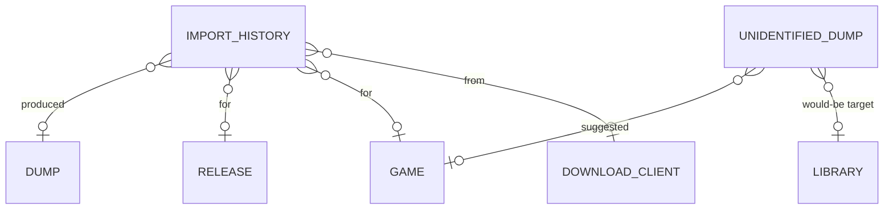

# Data Model — Import Pipeline

This document is the source of truth for the importer feature's persistence
layer. It is consumed by Alembic migration `0008_import_pipeline.py` and by
SQLAlchemy 2.0 async models in `src/romarr/importer/models.py`. **One new
table** (`import_history`) plus **column additions** to the existing
`unidentified_dump` table from foundation.

## Entity-Relationship Additions



All FK targets in `import_history` are NULLable because:
- A failed import may not yet know its `game_id` / `release_id` / `dump_id`.
- Cleanup (e.g., deleting a Game) should preserve the audit row.

`ON DELETE SET NULL` is the right policy on every FK in this feature — audit
rows survive their referents.

## Tables

### 1. `import_history` (new)

Audit trail of every import round, success or failure. Append-only at the
application level (no UPDATEs after creation; failed imports get a new row
on retry).

| Column | Type | Constraints / Notes |
|---|---|---|
| `id` | INTEGER | PK |
| `source_path` | TEXT | NOT NULL; the path inside the download client / extracted folder |
| `dest_path` | TEXT | nullable; populated on success only |
| `download_client_id` | INTEGER | nullable; FK → `download_client.id` ON DELETE SET NULL |
| `download_client_native_id` | TEXT | nullable; the client's torrent / nzb id (e.g., qBit info-hash, SAB nzo_id) |
| `game_id` | INTEGER | nullable; FK → `game.id` ON DELETE SET NULL |
| `release_id` | INTEGER | nullable; FK → `release.id` ON DELETE SET NULL |
| `dump_id` | INTEGER | nullable; FK → `dump.id` ON DELETE SET NULL |
| `source_hash_sha1` | TEXT | nullable; lowercase hex 40 chars; populated once hashing succeeds |
| `confidence` | NUMERIC(4,2) | nullable; identification confidence 0.00 - 1.00 |
| `imported_via` | TEXT | NOT NULL CHECK in (`automatic`, `manual`, `rss`, `api`, `webhook`) |
| `success` | BOOLEAN | NOT NULL |
| `coalesced` | BOOLEAN | NOT NULL DEFAULT false; true when a concurrent import detected a pre-existing Dump and short-circuited (FR-033) |
| `warning` | TEXT | nullable; structured warning code (e.g., `dat_unverified`) |
| `error_msg` | TEXT | nullable; populated on `success = false` with structured `<phase>:<sub-reason>` |
| `imported_by` | TEXT | nullable; user identifier (Auth spec wires the real value); `'system'` for automatic flows |
| `correlation_id` | TEXT | NOT NULL; UUIDv4 grouping a parent batch import (e.g., a multi-disc set produces N rows sharing a correlation id) |
| `started_at` | TIMESTAMP | NOT NULL DEFAULT CURRENT_TIMESTAMP |
| `finished_at` | TIMESTAMP | nullable; NULL when the import was interrupted |
| `duration_ms` | INTEGER | nullable |

Indexes:

- non-unique on `started_at DESC` for the default UI list.
- non-unique on `(release_id, started_at DESC)` for the per-Release view.
- non-unique on `correlation_id` for the multi-disc / batch join.
- non-unique on `download_client_native_id` to support webhook lookups
  (FR-002).
- non-unique on `success` for "show me failures" filtering.

Notes:

- A retry creates a **new row**; the original is preserved.
- `coalesced = true` rows are logically successful but did no work; they
  exist so the operator can see "5 callers all tried; 1 actually imported,
  4 coalesced."

### 2. `unidentified_dump` extensions

The foundation `unidentified_dump` table gains three columns. All NULLable.

| Column | Type | Constraints / Notes |
|---|---|---|
| `rejection_reason` | TEXT | nullable; structured (e.g., `profile:dump:hack_disallowed`, `extract:depth-exceeded`, `match:no_game`) |
| `library_id` | INTEGER | nullable; FK → `library.id` ON DELETE SET NULL; populated when the file would have targeted a known library |
| `suggested_game_id` | INTEGER | nullable; FK → `game.id` ON DELETE SET NULL; populated when DAT match knew an IGDB ID for an unmonitored Game (FR-016) |

Indexes added:

- non-unique on `rejection_reason` to support UI filtering by reason category.

The migration adds these columns via `op.batch_alter_table` for
SQLite-PostgreSQL parity.

## Forward dependencies (for Library spec, scheduled as 010)

The migration references the future `library` table on the
`unidentified_dump.library_id` FK. Since Library may not yet exist when
this migration runs:

```python
def upgrade() -> None:
    bind = op.get_bind()
    library_exists = bind.dialect.has_table(bind, "library")

    op.create_table("import_history", ...)

    with op.batch_alter_table("unidentified_dump") as batch:
        batch.add_column(sa.Column("rejection_reason", sa.Text, nullable=True))
        batch.add_column(sa.Column("suggested_game_id", sa.Integer, nullable=True))
        batch.add_column(sa.Column("library_id", sa.Integer, nullable=True))

        # FK on suggested_game_id (safe — game table exists since foundation)
        batch.create_foreign_key(
            "fk_unidentified_dump_suggested_game",
            "game",
            ["suggested_game_id"], ["id"],
            ondelete="SET NULL",
        )

        # FK on library_id only when library table already exists
        if library_exists:
            batch.create_foreign_key(
                "fk_unidentified_dump_library",
                "library",
                ["library_id"], ["id"],
                ondelete="SET NULL",
            )
```

If the operator ships Library after Import, the Library migration is
responsible for adding the deferred FK on `unidentified_dump.library_id`.

## Value Types (not persisted)

These live in `src/romarr/importer/types.py` and are the working memory of
the pipeline. They flow from one step to the next inside the orchestrator.

```python
class RejectionReason(StrEnum):
    EXTRACT_DEPTH_EXCEEDED = "extract:depth-exceeded"
    EXTRACT_BAD_ARCHIVE = "extract:bad-archive"
    HASH_FAILED = "hash:failed"
    NO_GAME_MATCH = "match:no_game"
    PROFILE_REGION_REJECT = "profile:region"
    PROFILE_LANGUAGE_REJECT = "profile:language"
    PROFILE_DUMP_REJECT = "profile:dump"
    PROFILE_QUALITY_REJECT = "profile:quality"
    REQUIRE_DAT_VERIFIED_FAILED = "profile:quality:require_dat_verified"
    MOVE_HASH_MISMATCH = "move:copy_hash_mismatch"
    MOVE_PERMISSION_ERROR = "move:permission_error"
    MOVE_DISK_FULL = "move:disk_full"
    LOCK_TIMEOUT = "lock:timeout"

class ImportContext(BaseModel):
    download_client_id: int | None
    download_client_native_id: str | None
    source_path: Path
    library_id: int | None             # populated once we know the target library
    target_library_lifecycle_policy: Literal["hardlink_and_seed","move_and_remove","copy_and_keep"] | None
    target_library_keep_dump_history: bool | None
    target_library_path: Path | None
    correlation_id: UUID
    imported_via: Literal["automatic","manual","rss","api","webhook"]
    imported_by: str
    force: bool = False                # manual flow only

class MultiDiscGroup(BaseModel):
    parent_index: int
    member_paths: list[Path]
    detection_signal: Literal["cue_bin","filename_pattern","stem_heuristic"]

class LifecycleAction(BaseModel):
    kind: Literal["tag_imported","schedule_remove","noop"]
    download_client_id: int
    download_client_native_id: str
    not_before: datetime | None        # populated for schedule_remove with the grace deadline

class ImportOutcome(BaseModel):
    success: bool
    coalesced: bool = False
    dest_path: Path | None
    dump_id: int | None
    release_id: int | None
    game_id: int | None
    confidence: float | None
    warning: str | None
    error_msg: str | None
    rejection_reason: RejectionReason | None
    history_id: int                    # the import_history row produced
    correlation_id: UUID
    duration_ms: int
```

## Pydantic Schemas (persisted entities)

In `src/romarr/importer/schemas.py`:

- `ImportHistoryRead` — exposes everything; no Create/Update (system-written
  only).
- `UnidentifiedDumpRead` (extension of foundation's read schema) — adds the
  three new fields.
- `ManualImportRequest` — accepts a list of
  `{path, game_id, release_id?, force?}` triples.
- `ManualMatchRequest` — accepts `{game_id, release_id?}` for the
  unidentified-match endpoint.
- `RetryResponse` — wraps the new `ImportHistoryRead` produced by retry.
- `WebhookPayload` — a discriminated union over the supported client
  payload shapes (qBittorrent, SABnzbd; future Transmission/Deluge/NZBGet
  add new variants).

## Migration `0008_import_pipeline.py` — Summary

1. `CREATE TABLE import_history` (DDL above).
2. `op.batch_alter_table("unidentified_dump")` adds the three new columns
   plus the `suggested_game_id` FK; the `library_id` FK is added only when
   `library` already exists (gated; documented in the Forward Dependency
   section).
3. No data seeding — import history is system-written at runtime.

The migration's downgrade path drops the FKs first, then the columns, then
`import_history`.
