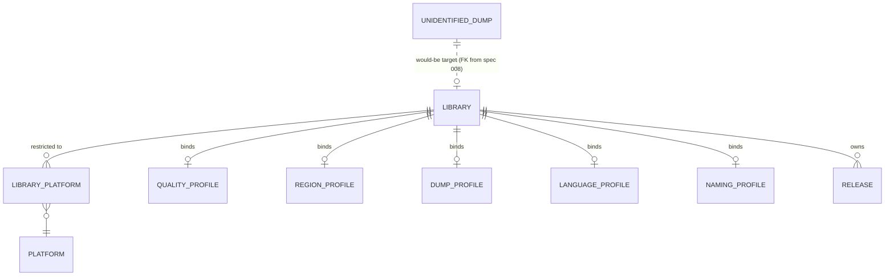

# Data Model — Library Management & Exporters

This document is the source of truth for the libraries feature's
persistence layer. It is consumed by Alembic migration `0009_libraries.py`
and by SQLAlchemy 2.0 async models in `src/romarr/libraries/models.py`.
**One new table** (`library`) plus **one m2m** (`library_platform`)
plus a **column addition** on the existing `release` table
(`library_id`).

This migration is the one the Import Pipeline spec (008) was waiting on:
the FK on `unidentified_dump.library_id` (queued by spec 008's gated
migration) is finalised here when `library` materialises.

## Entity-Relationship Additions



## Tables

### 1. `library`

The core entity introduced by this spec.

| Column | Type | Constraints / Notes |
|---|---|---|
| `id` | INTEGER | PK |
| `name` | TEXT | UNIQUE NOT NULL |
| `path` | TEXT | NOT NULL; absolute root directory; validated existing+writable at save (FR-004) |
| `platform_subfolders` | BOOLEAN | NOT NULL DEFAULT true |
| `platforms_restricted` | BOOLEAN | NOT NULL DEFAULT false |
| `quality_profile_id` | INTEGER | NOT NULL; FK → `quality_profile.id` ON DELETE RESTRICT |
| `region_profile_id` | INTEGER | NOT NULL; FK → `region_profile.id` ON DELETE RESTRICT |
| `dump_profile_id` | INTEGER | NOT NULL; FK → `dump_profile.id` ON DELETE RESTRICT |
| `language_profile_id` | INTEGER | NOT NULL; FK → `language_profile.id` ON DELETE RESTRICT |
| `naming_profile_id` | INTEGER | NOT NULL; FK → `naming_profile.id` ON DELETE RESTRICT |
| `monitored_default` | BOOLEAN | NOT NULL DEFAULT true |
| `use_hardlinks` | BOOLEAN | NOT NULL DEFAULT true |
| `lifecycle_policy` | TEXT | NOT NULL CHECK in (`hardlink_and_seed`, `move_and_remove`, `copy_and_keep`) DEFAULT `'hardlink_and_seed'` |
| `delete_after_import` | BOOLEAN | NOT NULL DEFAULT false |
| `keep_dump_history` | BOOLEAN | NOT NULL DEFAULT false |
| `min_disk_free_gb` | INTEGER | NOT NULL DEFAULT 5 |
| `preserve_archive` | BOOLEAN | NOT NULL DEFAULT false; consumed by spec 008's extractor |
| `exporter_romm_enabled` | BOOLEAN | NOT NULL DEFAULT false |
| `exporter_romm_url` | TEXT | nullable |
| `exporter_romm_api_key_encrypted` | BLOB | nullable; Fernet token wrapping the API key (FR-034) |
| `exporter_esde_enabled` | BOOLEAN | NOT NULL DEFAULT false |
| `exporter_pegasus_enabled` | BOOLEAN | NOT NULL DEFAULT false |
| `exporter_launchbox_enabled` | BOOLEAN | NOT NULL DEFAULT false |
| `exporter_launchbox_per_platform` | BOOLEAN | NOT NULL DEFAULT true; when false, emit a single global file at `<library_path>/launchbox-export.xml` |
| `scan_poll_seconds` | INTEGER | NOT NULL DEFAULT 3600; polling fallback interval when inotify is unavailable |
| `heartbeat_seconds` | INTEGER | NOT NULL DEFAULT 30; per-library heartbeat cadence |
| `status` | TEXT | NOT NULL CHECK in (`ok`, `unavailable`) DEFAULT `'ok'` |
| `last_full_scan_at` | TIMESTAMP | nullable |
| `last_incremental_scan_at` | TIMESTAMP | nullable |
| `last_scan_status` | TEXT | nullable; structured (`success`, `partial`, `failed`) |
| `last_heartbeat_at` | TIMESTAMP | nullable |
| `created_at` | TIMESTAMP | NOT NULL DEFAULT CURRENT_TIMESTAMP |
| `updated_at` | TIMESTAMP | NOT NULL DEFAULT CURRENT_TIMESTAMP |

Validators (Pydantic):

- `path` must be absolute, exist, and be writable AT save time
  (FR-004).
- When `platforms_restricted = true`, the `library_platform` m2m must
  contain at least one row (FR-005).
- When `exporter_romm_enabled = true`, both `exporter_romm_url` and
  `exporter_romm_api_key_encrypted` must be populated.
- `min_disk_free_gb >= 1`.
- `name` non-empty and ≤ 100 characters.

Indexes:

- UNIQUE on `name`.
- non-unique on `status` for fast filtering of available libraries
  during routing.

`ON DELETE RESTRICT` on every profile FK is the constitutional
counterpart of spec 006's force-delete protection: a library cannot
silently orphan its profiles.

### 2. `library_platform` (m2m)

| Column | Type | Constraints / Notes |
|---|---|---|
| `library_id` | INTEGER | NOT NULL; FK → `library.id` ON DELETE CASCADE |
| `platform_id` | INTEGER | NOT NULL; FK → `platform.id` ON DELETE CASCADE |
| `created_at` | TIMESTAMP | NOT NULL DEFAULT CURRENT_TIMESTAMP |

Constraints:

- Composite PK on `(library_id, platform_id)`.

Notes:

- Empty m2m + `library.platforms_restricted = false` ⇒ library accepts
  any platform (open allowlist).
- Empty m2m + `library.platforms_restricted = true` ⇒ rejected at
  validation (FR-005).
- Cascade-on-delete keeps the m2m clean when a library or platform
  goes away.

### 3. `release.library_id` — column addition

| Column | Type | Constraints / Notes |
|---|---|---|
| `library_id` | INTEGER | nullable; FK → `library.id` ON DELETE SET NULL |

Set NULL on library delete is intentional (FR-026): the Release row
must survive even if its library is force-deleted, so the operator can
re-bind it to another library.

### 4. `unidentified_dump.library_id` FK — finalised

The Import Pipeline spec (008) introduced the column but gated the FK
on `library` existing. This migration finalises the FK:

```python
def upgrade() -> None:
    bind = op.get_bind()
    op.create_table("library", ...)
    op.create_table("library_platform", ...)

    with op.batch_alter_table("release") as batch:
        batch.add_column(sa.Column("library_id", sa.Integer, nullable=True))
        batch.create_foreign_key(
            "fk_release_library_id",
            "library", ["library_id"], ["id"],
            ondelete="SET NULL",
        )

    # Finalise the spec-008 FK that was waiting on this table.
    if not _fk_exists(bind, "unidentified_dump", "fk_unidentified_dump_library"):
        with op.batch_alter_table("unidentified_dump") as batch:
            batch.create_foreign_key(
                "fk_unidentified_dump_library",
                "library", ["library_id"], ["id"],
                ondelete="SET NULL",
            )
```

If Import Pipeline spec ships first, the FK is added here. If Library
spec ships first, spec 008's migration adds it itself. Either order
works.

## Value Types (not persisted)

These live in `src/romarr/libraries/types.py`.

```python
class LibraryStatus(StrEnum):
    OK = "ok"
    UNAVAILABLE = "unavailable"

class LibrarySnapshot(BaseModel):
    """Slim shape preloaded by the router and the heartbeat loop."""
    id: int
    name: str
    path: Path
    status: LibraryStatus
    platforms_restricted: bool
    accepted_platform_ids: frozenset[int]
    quality_profile_id: int
    region_profile_id: int
    dump_profile_id: int
    language_profile_id: int
    naming_profile_id: int
    use_hardlinks: bool
    lifecycle_policy: Literal["hardlink_and_seed", "move_and_remove", "copy_and_keep"]
    keep_dump_history: bool
    min_disk_free_gb: int
    preserve_archive: bool

class RoutingChoice(BaseModel):
    chosen_library_id: int | None
    chosen_via: Literal["only_eligible", "profile_match", "lower_id_tiebreak", "no_eligible_library"]
    candidates_considered: list[int]
    rejection_reason: str | None  # populated when chosen_library_id is None

class ScanProgress(BaseModel):
    library_id: int
    scan_kind: Literal["full", "incremental"]
    files_seen: int
    files_processed: int
    files_orphaned: int
    started_at: datetime
    last_event_at: datetime
    finished_at: datetime | None
    last_status: Literal["running", "success", "partial", "failed"]
    last_error: str | None

class ExporterOutcome(BaseModel):
    name: Literal["romm", "esde", "pegasus", "launchbox"]
    library_id: int
    platform_id: int | None  # NULL for global LaunchBox export
    success: bool
    files_emitted: int
    error_message: str | None
    duration_ms: int
    finished_at: datetime
```

## Pydantic Schemas (persisted entities)

In `src/romarr/libraries/schemas.py`:

- `LibraryRead` — exposes everything except
  `exporter_romm_api_key_encrypted`; carries `is_romm_configured: bool`
  derived from the blob.
- `LibraryCreate` — accepts plaintext `exporter_romm_api_key`; the
  application encrypts on the way in.
- `LibraryUpdate` — all fields optional with `extra = 'forbid'`.
- `LibraryPlatformRead` — slim view of the m2m for the frontend.
- `ScanResult` — wraps a `ScanProgress` produced by a scan run.
- `ManualImportListing` — per-file identification result for the GET
  manual-import endpoint.
- `ManualImportRequest` — list of
  `(file_path, game_id, release_id, library_id, action)`.
- `ManualImportResult` — per-entry success/failure carrying spec 008's
  `ImportOutcome`.

## Migration `0009_libraries.py` — Summary

1. `CREATE TABLE library` (DDL above) with the five profile FKs and
   the heartbeat status.
2. `CREATE TABLE library_platform` (composite PK m2m).
3. Add `release.library_id INTEGER NULL` with FK to `library(id)` ON
   DELETE SET NULL.
4. If `fk_unidentified_dump_library` does not yet exist on
   `unidentified_dump`, add it (closes the spec-008 forward
   dependency).
5. No data seeding — the operator creates libraries via the API.

The migration's downgrade path drops the FK on `release.library_id`
first, then the m2m, then the `library` table. The
`unidentified_dump` FK is dropped as part of the spec-008 downgrade
when needed.

## Schema Delta — Session 2026-04-29 Clarifications

### `0009_library.py` is the integrating migration for forward-referenced FKs

Per spec 006 FR-004 (clarified) and spec 008's `unidentified_dump`
extension (already in scope), this migration owns:

1. `library` table (full DDL elsewhere in this file).
2. `library_platform` m2m (full DDL elsewhere).
3. `Release.library_id INTEGER NULLABLE` FK with `ON DELETE SET NULL`.
4. The **five Library → Profile FKs** declared as forward references
   by spec 006:
   ```sql
   ALTER TABLE library
     ADD COLUMN quality_profile_id  INTEGER REFERENCES quality_profile(id)  ON DELETE SET NULL,
     ADD COLUMN region_profile_id   INTEGER REFERENCES region_profile(id)   ON DELETE SET NULL,
     ADD COLUMN dump_profile_id     INTEGER REFERENCES dump_profile(id)     ON DELETE SET NULL,
     ADD COLUMN language_profile_id INTEGER REFERENCES language_profile(id) ON DELETE SET NULL,
     ADD COLUMN naming_profile_id   INTEGER REFERENCES naming_profile(id)   ON DELETE SET NULL;
   ```
5. The `library_id` FK on `library_custom_format` (which spec 006
   created with `custom_format_id` only):
   ```sql
   ALTER TABLE library_custom_format
     ADD COLUMN library_id INTEGER NOT NULL REFERENCES library(id) ON DELETE CASCADE;

   ALTER TABLE library_custom_format
     ADD CONSTRAINT uq_library_custom_format
       UNIQUE (library_id, custom_format_id);
   ```

### Post-migration backfill (FR-003a)

Within the same Alembic migration's `upgrade()` body, after the table
DDL settles, run:

```python
op.execute("""
    UPDATE release
       SET library_id = :new_library_id
     WHERE library_id IS NULL
       AND id IN (
         SELECT release_id
           FROM dump
          WHERE path LIKE :path_prefix
       )
""")
```

…wrapped in a Python loop over each newly-created library row. After
the loop, count remaining `library_id IS NULL` releases and emit a
single `OnHealthIssue` event with `category = 'orphan-releases'` if
non-zero.
