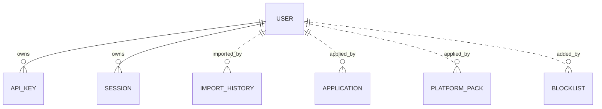

# Data Model — Authentication & Multi-User

This document is the source of truth for the auth feature's
persistence layer. It is consumed by Alembic migration `0010_auth.py`
and by SQLAlchemy 2.0 async models in `src/romarr/auth/models.py`.

The migration delivers four things:

1. **Two new tables**: `user`, `api_key`.
2. **An optional `session` table** as a DB fallback for the
   server-side session store (Redis is preferred, but the table is
   created so the fallback path always works).
3. **A sentinel `system` user** with `id = 1` so existing
   `*_by = 'system'` strings can be FK-migrated cleanly.
4. **FK conversions** of four existing TEXT columns from earlier
   specs: `import_history.imported_by`, `application.applied_by`,
   `platform_pack.applied_by`, `blocklist.added_by`.

## Entity-Relationship Additions



## Tables

### 1. `user`

| Column | Type | Constraints / Notes |
|---|---|---|
| `id` | INTEGER | PK |
| `username` | TEXT | UNIQUE NOT NULL |
| `email` | TEXT | nullable; UNIQUE when set |
| `hashed_password` | TEXT | nullable; bcrypt cost 12; NULL for OIDC-only or proxy-only users |
| `full_name` | TEXT | nullable |
| `is_active` | BOOLEAN | NOT NULL DEFAULT true |
| `is_superuser` | BOOLEAN | NOT NULL DEFAULT false |
| `role` | TEXT | NOT NULL CHECK in (`admin`, `user`, `readonly`) DEFAULT `'user'` |
| `oidc_subject` | TEXT | nullable; format `<provider>:<sub>` |
| `oidc_provider` | TEXT | nullable; the issuer URL or a short id |
| `preferences` | JSON | NOT NULL DEFAULT `{}` (theme, language, default library, notification opt-in) |
| `last_login_at` | TIMESTAMP | nullable; updated best-effort on success |
| `last_login_ip` | TEXT | nullable |
| `created_at` | TIMESTAMP | NOT NULL DEFAULT CURRENT_TIMESTAMP |
| `updated_at` | TIMESTAMP | NOT NULL DEFAULT CURRENT_TIMESTAMP |

Indexes:

- UNIQUE on `username`.
- partial UNIQUE on `email` (where `email IS NOT NULL`).
- non-unique on `(oidc_provider, oidc_subject)` for OIDC lookups.
- non-unique on `is_active` for fast active-user filtering.

Invariants (Pydantic):

- `is_superuser = true` ⇒ `role = 'admin'` (kept in sync; the column
  exists separately because future per-feature roles may live there).
- `hashed_password IS NULL` requires `oidc_subject IS NOT NULL` OR
  `is_active = false` — a user with no password and no OIDC link
  cannot log in (only proxy auth could authenticate them).
- `username` matches `^[a-zA-Z0-9._-]{1,64}$`.

### 2. `api_key`

| Column | Type | Constraints / Notes |
|---|---|---|
| `id` | INTEGER | PK |
| `user_id` | INTEGER | NOT NULL; FK → `user.id` ON DELETE CASCADE |
| `name` | TEXT | NOT NULL; operator-supplied label |
| `key_hash` | BLOB | NOT NULL; BLAKE2b digest (32 bytes) of the plaintext key |
| `key_prefix` | TEXT | NOT NULL; first 8 chars of the plaintext key (display-only) |
| `scopes` | JSON | NOT NULL DEFAULT `["read"]`; list of string permissions |
| `expires_at` | TIMESTAMP | nullable; NULL = never expires |
| `revoked_at` | TIMESTAMP | nullable; populated on revoke |
| `last_used_at` | TIMESTAMP | nullable; updated best-effort |
| `last_used_ip` | TEXT | nullable |
| `created_at` | TIMESTAMP | NOT NULL DEFAULT CURRENT_TIMESTAMP |

Indexes:

- UNIQUE on `key_hash` (the constitutional O(1) lookup).
- non-unique on `user_id`.
- non-unique on `revoked_at` for "show me active keys" filtering.

Notes:

- The plaintext key has format `rmk_<43 chars>` where the 43 chars are
  `secrets.token_urlsafe(32)`. The `key_prefix` stored is the first 8
  chars **including** `rmk_` so operators can recognise their own keys
  in the UI without exposing the full secret.
- BLAKE2b is used (32-byte digest, `hashlib.blake2b(key, digest_size=32)`)
  because it is faster than bcrypt for high-volume API key validation
  while still giving a cryptographically strong fixed-length hash.
- A revoked key keeps its row (audit trail) but `revoked_at IS NOT NULL`
  is treated as "no longer valid" by the auth chain.
- `scopes` are validated against a known whitelist on save:
  `read`, `write`, `admin`. Future fine-grained scopes can be added
  without schema migration.

### 3. `session` (DB fallback for the session store)

This table exists so the server-side session store works even when
Redis is unavailable. Redis is the preferred backend in production.

| Column | Type | Constraints / Notes |
|---|---|---|
| `id` | TEXT | PK; the session id (cryptographically random, 32 bytes URL-safe) |
| `user_id` | INTEGER | NOT NULL; FK → `user.id` ON DELETE CASCADE |
| `created_at` | TIMESTAMP | NOT NULL DEFAULT CURRENT_TIMESTAMP |
| `last_seen_at` | TIMESTAMP | NOT NULL DEFAULT CURRENT_TIMESTAMP |
| `expires_at` | TIMESTAMP | NOT NULL |
| `user_agent` | TEXT | nullable |
| `ip` | TEXT | nullable |

Indexes:

- non-unique on `expires_at` for periodic cleanup.
- non-unique on `user_id` for "log me out everywhere" support.

The Redis backend stores `session:<id>` keys with TTL aligned to
`expires_at`. When Redis fails, the auth chain falls back to a query
against this table; on success the result is cached briefly in memory
to avoid hot-pathing the DB.

### 4. `setup_token` (single-row table)

| Column | Type | Constraints / Notes |
|---|---|---|
| `id` | INTEGER | PK; constrained to `id = 1` so only one row can ever exist |
| `token_hash` | BLOB | NOT NULL; BLAKE2b digest of the plaintext setup token |
| `created_at` | TIMESTAMP | NOT NULL DEFAULT CURRENT_TIMESTAMP |
| `expires_at` | TIMESTAMP | NOT NULL; `created_at + 24 hours` |
| `consumed_at` | TIMESTAMP | nullable; populated on success |

Notes:

- The row exists only when the application has decided to publish a
  setup token (i.e., on first boot with empty user table).
- `consumed_at IS NOT NULL` ⇒ the token has been used and MUST NOT be
  honoured even if it has not yet expired.
- After successful setup, the row is left in place (audit trail). A
  future `consumed_at IS NOT NULL` row blocks any future
  setup-token regeneration attempts (FR-021).

### 5. `*_by` column FK conversions (4 columns)

The migration converts four existing TEXT columns to FK INTEGER:

| Table | Column | Old type | New type |
|---|---|---|---|
| `import_history` | `imported_by` | TEXT | INTEGER FK → user.id ON DELETE SET NULL |
| `platform_pack` | `applied_by` | TEXT | INTEGER FK → user.id ON DELETE SET NULL |
| `application` (Prowlarr) | (none — uses `app_token_hash`) | — | not changed |
| `blocklist` | `added_by` | TEXT | INTEGER FK → user.id ON DELETE SET NULL |
| `import_history` | `imported_by_id` (new) | — | INTEGER FK → user.id ON DELETE SET NULL |
| `platform_pack` | `applied_by_id` (new) | — | INTEGER FK → user.id ON DELETE SET NULL |
| `blocklist` | `added_by_id` (new) | — | INTEGER FK → user.id ON DELETE SET NULL |

Strategy (per `plan.md` Phase 0 research):

1. Insert sentinel user `(id=1, username='system', is_active=false,
   is_superuser=true, role='admin', hashed_password=NULL)` first.
2. Add the new `*_by_id` INTEGER columns (NULLable).
3. Backfill: `UPDATE … SET imported_by_id = 1 WHERE imported_by = 'system'`.
4. For PostgreSQL: drop the old TEXT columns; rename `*_by_id` to
   the original `*_by`. For SQLite: rebuild via `batch_alter_table`
   to achieve the same effect.
5. The FK is added as part of the rename step.

Final shape: every audit row that used to carry `'system'` now carries
`user_id = 1`; every operator-issued audit row carries the operator's
real id.

## Value Types (not persisted)

These live in `src/romarr/auth/types.py`.

```python
class Role(StrEnum):
    ADMIN = "admin"
    USER = "user"
    READONLY = "readonly"

ROLE_HIERARCHY = {
    Role.ADMIN: 3,
    Role.USER: 2,
    Role.READONLY: 1,
}
# admin >= user >= readonly

class AuthMethod(StrEnum):
    API_KEY = "api_key"
    SESSION = "session"
    JWT = "jwt"
    PROXY = "proxy"

class AuthContext(BaseModel):
    user_id: int
    username: str
    role: Role
    is_active: bool
    method: AuthMethod
    api_key_id: int | None = None        # populated when method == API_KEY
    scopes: list[str] = []                # populated when method == API_KEY
    session_id: str | None = None         # populated when method == SESSION
    request_ip: str | None = None
    request_at: datetime
```

## Pydantic Schemas

In `src/romarr/auth/schemas.py`:

- `UserRead` — exposes everything except `hashed_password`; carries
  `is_oidc_linked: bool` derived from `oidc_subject`.
- `UserCreate` — accepts a plaintext `password` (optional, can be
  NULL for OIDC-only users); the application bcrypt-hashes on the
  way in.
- `UserUpdate` — all fields optional, `extra='forbid'`.
- `ApiKeyRead` — exposes everything except `key_hash`; carries
  `is_active: bool` derived from `revoked_at IS NULL AND
  (expires_at IS NULL OR expires_at > now())`.
- `ApiKeyCreate` — accepts `{name, scopes, expires_at?}`.
- `ApiKeyCreateResponse` — wraps `ApiKeyRead` plus a one-shot
  `plaintext_key` field; this field is removed from the schema for
  any subsequent reads.
- `LoginRequest` — `{username, password}`.
- `SetupRequest` — `{username, password, full_name?, email?}`.
- `OidcStartResponse` — `{authorization_url}`.
- `PreferencesUpdate` — accepts a free-form JSON dict; subject to a
  size limit (4 KiB).

## Migration `0010_auth.py` — Summary

1. `CREATE TABLE user` (DDL above).
2. `CREATE TABLE api_key` with the UNIQUE on `key_hash`.
3. `CREATE TABLE session` (the DB session-store fallback).
4. `CREATE TABLE setup_token` with the `id = 1` CHECK.
5. INSERT the sentinel `system` user with `id = 1` (uses an
   ID-reserving INSERT or a pre-known PK).
6. The four `*_by` FK conversions per the Strategy above; data
   preservation verified via row-count checks.
7. No data seeding for end-user accounts.

The migration's downgrade path reverses the FK conversions (TEXT
→ INTEGER columns are irreversible without losing operator-id
specificity, but the strings can be reconstructed by joining on
the user table); for an MVP downgrade we keep `system` and lose
real-user audit attribution. Document this in the migration's
docstring.

## Schema Delta — Session 2026-04-29 Clarifications

### `user` schema — single `role` column, NO `is_superuser`

Per FR-001 (clarified), the `user` table MUST NOT carry an `is_superuser`
column:

```sql
CREATE TABLE "user" (
  id              INTEGER PRIMARY KEY AUTOINCREMENT,
  username        VARCHAR NOT NULL UNIQUE,
  email           VARCHAR NULL UNIQUE,
  hashed_password VARCHAR NULL,                          -- NULL for OIDC-only users
  is_active       BOOLEAN NOT NULL DEFAULT true,
  role            VARCHAR NOT NULL DEFAULT 'user'
                     CHECK (role IN ('admin', 'user', 'readonly')),
  oidc_subject    VARCHAR NULL,
  oidc_provider   VARCHAR NULL,
  preferences     JSON NOT NULL DEFAULT '{}',
  last_login_at   TIMESTAMP NULL,
  created_at      TIMESTAMP NOT NULL DEFAULT current_timestamp,
  updated_at      TIMESTAMP NOT NULL DEFAULT current_timestamp,
  UNIQUE (oidc_provider, oidc_subject)
);
```

`User.is_superuser` is a Python read-only property derived from
`self.role == 'admin'`; it is never persisted, never UPDATE-able.

### `session` — sliding 30-day TTL

Per FR-012a:

```sql
CREATE TABLE session (
  id            VARCHAR PRIMARY KEY,                   -- random 32-byte URL-safe token
  user_id       INTEGER NOT NULL REFERENCES "user"(id) ON DELETE CASCADE,
  last_used_at  TIMESTAMP NOT NULL DEFAULT current_timestamp,
  expires_at    TIMESTAMP NOT NULL,                    -- = last_used_at + 30 days
  user_agent    VARCHAR NULL,
  ip_address    VARCHAR NULL,
  created_at    TIMESTAMP NOT NULL DEFAULT current_timestamp
);

CREATE INDEX idx_session_user_id ON session (user_id);
CREATE INDEX idx_session_expires_at ON session (expires_at);
```

Every authenticated request that resolves the session updates
`last_used_at` and recomputes `expires_at = now + 30 days` (best-effort,
non-blocking per FR-027).

### `api_key` — coarse 3-tier scopes

Per FR-009a:

```sql
CREATE TABLE api_key (
  id             INTEGER PRIMARY KEY AUTOINCREMENT,
  user_id        INTEGER NOT NULL REFERENCES "user"(id) ON DELETE CASCADE,
  name           VARCHAR NOT NULL,
  key_hash       VARCHAR NOT NULL UNIQUE,             -- BLAKE2b digest
  key_prefix     VARCHAR NOT NULL,                    -- first 8 chars of plaintext
  scopes         JSON NOT NULL DEFAULT '["read"]',    -- subset of ["read", "write", "admin"]
  expires_at     TIMESTAMP NULL,
  last_used_at   TIMESTAMP NULL,
  last_used_ip   VARCHAR NULL,
  created_at     TIMESTAMP NOT NULL DEFAULT current_timestamp
);

CREATE INDEX idx_api_key_hash ON api_key (key_hash);
```

Validator enforces `scopes ⊆ {"read", "write", "admin"}` at save time.

### `*_by` text columns become FK INTEGER references to `user.id`

Per the existing migration plan, the following columns shipped in
prior specs as `VARCHAR` (with `'system'` sentinel values) become
`INTEGER` FKs:

- `import_history.imported_by`
- `platform_pack.applied_by`
- `application.applied_by`
- `blocklist.added_by`

Migration preserves the `'system'` sentinel as a row in `user` with
`id = 0`, `username = 'system'`, `is_active = false`, `role = 'admin'`,
`hashed_password = NULL`. Existing rows backfill via:

```sql
UPDATE import_history       SET imported_by = 0 WHERE imported_by = 'system';
UPDATE platform_pack        SET applied_by  = 0 WHERE applied_by  = 'system';
UPDATE application          SET applied_by  = 0 WHERE applied_by  = 'system';
UPDATE blocklist            SET added_by    = 0 WHERE added_by    = 'system';
-- column type change happens in a follow-up DDL step
```

### No JWT issuance state

Per FR-022 (clarified), Romarr does NOT mint its own JWTs at MVP.
The schema MUST NOT carry a `jwt_signing_key` column, JWT-related
cache tables, or any issuance audit log.
