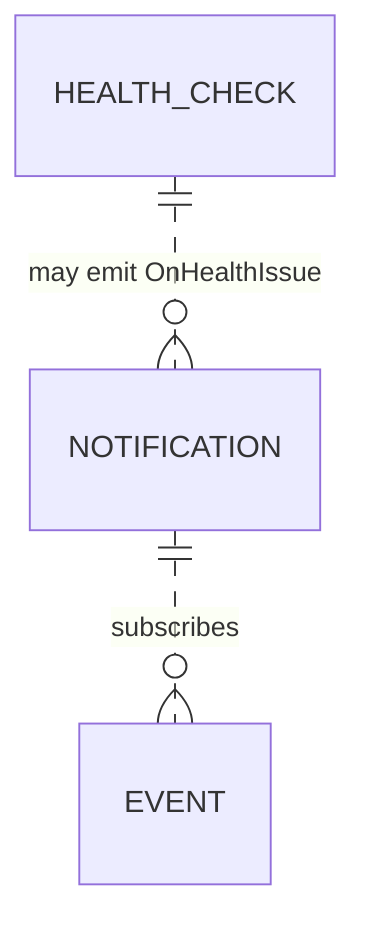

# Data Model — Notifications & Health

This document is the source of truth for the notifications feature's
persistence layer. It is consumed by Alembic migration
`0011_notifications.py` and by SQLAlchemy 2.0 async models in
`src/romarr/notifications/models.py`. **Two new tables**
(`notification`, `health_check`); no column additions on existing
tables.

## Entity-Relationship Additions



Both tables are standalone — no FKs into other features. The
`notification.tags` field is a JSON array of tag names; the
operator's `tag` system is a separate (small) table introduced by
the future REST API spec, but this feature only reads tag names by
string match against the Game's tag list.

## Tables

### 1. `notification`

| Column | Type | Constraints / Notes |
|---|---|---|
| `id` | INTEGER | PK |
| `name` | TEXT | UNIQUE NOT NULL |
| `apprise_url_encrypted` | BLOB | NOT NULL; Fernet token wrapping the plaintext Apprise URL |
| `apprise_url_scheme` | TEXT | NOT NULL; the URL's scheme prefix kept plain (e.g., `discord`, `tgram`, `ntfys`, `mailto`) for redacted display |
| `on_grab` | BOOLEAN | NOT NULL DEFAULT false |
| `on_import` | BOOLEAN | NOT NULL DEFAULT true |
| `on_upgrade` | BOOLEAN | NOT NULL DEFAULT true |
| `on_fail` | BOOLEAN | NOT NULL DEFAULT true |
| `on_health_issue` | BOOLEAN | NOT NULL DEFAULT true |
| `on_dat_update` | BOOLEAN | NOT NULL DEFAULT false |
| `on_game_added` | BOOLEAN | NOT NULL DEFAULT false |
| `tags` | JSON | NOT NULL DEFAULT `[]`; list of strings; empty = match all |
| `enabled` | BOOLEAN | NOT NULL DEFAULT true |
| `include_health_warnings` | BOOLEAN | NOT NULL DEFAULT true |
| `include_health_errors` | BOOLEAN | NOT NULL DEFAULT true |
| `on_grab_format` | TEXT | nullable; Jinja2 template override |
| `on_import_format` | TEXT | nullable |
| `on_upgrade_format` | TEXT | nullable |
| `on_fail_format` | TEXT | nullable |
| `on_health_issue_format` | TEXT | nullable |
| `on_dat_update_format` | TEXT | nullable |
| `on_game_added_format` | TEXT | nullable |
| `last_used_at` | TIMESTAMP | nullable |
| `last_status` | TEXT | nullable CHECK in (`success`, `failed`, `partial`) |
| `last_error` | TEXT | nullable |
| `created_at` | TIMESTAMP | NOT NULL DEFAULT CURRENT_TIMESTAMP |
| `updated_at` | TIMESTAMP | NOT NULL DEFAULT CURRENT_TIMESTAMP |

Indexes:

- UNIQUE on `name`.
- non-unique on `enabled` for fast filtering during dispatch.

Validators (Pydantic):

- At least one `on_*` flag MUST be `true` (FR rejected as
  `no_event_subscribed`).
- Each non-null `*_format` MUST validate at save time via spec
  006's sandboxed renderer: unknown variables and forbidden
  filters cause HTTP 400.
- `apprise_url_scheme` must match the actual Apprise URL's scheme;
  validated at save time by re-parsing the URL.

### 2. `health_check`

| Column | Type | Constraints / Notes |
|---|---|---|
| `id` | INTEGER | PK |
| `component` | TEXT | NOT NULL; structured (`indexer:MyIndexer`, `library:Cartridges`, `downloadclient:qbit-local`, `dat:no-intro:megadrive`, `db`, `metadata:igdb`) |
| `status` | TEXT | NOT NULL CHECK in (`ok`, `warning`, `error`) |
| `message` | TEXT | nullable; human-readable detail |
| `severity_changed_at` | TIMESTAMP | NOT NULL; updated on transitions only (used by debouncer) |
| `last_checked_at` | TIMESTAMP | NOT NULL DEFAULT CURRENT_TIMESTAMP; updated on every check cycle |
| `first_seen_at` | TIMESTAMP | NOT NULL; first time this component appeared |
| `last_seen_at` | TIMESTAMP | NOT NULL; updated on every check cycle (helps detect components that disappeared) |

Indexes:

- UNIQUE on `component` (one row per component, current state only).
- non-unique on `status` for fast "show me errors" filtering.
- non-unique on `severity_changed_at DESC` for the dashboard's
  recent-transitions view.

Notes:

- This table holds the **current** state only; historical trending
  is out of scope. The columns `severity_changed_at` and
  `first_seen_at` give the dashboard enough timeline data to render
  "down for 12 minutes" without a full history.
- A component that disappears (e.g., the operator deletes an
  indexer) leaves an orphan row that the engine prunes at the
  start of the next cycle (`last_seen_at < NOW() - 1 hour` →
  delete).

## Value Types (not persisted)

These live in `src/romarr/notifications/types.py`.

```python
class EventType(StrEnum):
    ON_GRAB = "OnGrab"
    ON_IMPORT = "OnImport"
    ON_UPGRADE = "OnUpgrade"
    ON_FAIL = "OnFail"
    ON_HEALTH_ISSUE = "OnHealthIssue"
    ON_DAT_UPDATE = "OnDatUpdate"
    ON_GAME_ADDED = "OnGameAdded"

class HealthStatus(StrEnum):
    OK = "ok"
    WARNING = "warning"
    ERROR = "error"

class ComponentCategory(StrEnum):
    INDEXER = "indexer"
    DOWNLOAD_CLIENT = "downloadclient"
    LIBRARY = "library"
    DAT = "dat"
    DB = "db"
    METADATA = "metadata"
    DISK = "disk"

class HealthCheckResult(BaseModel):
    component: str                       # e.g., "indexer:MyIndexer"
    category: ComponentCategory
    status: HealthStatus
    message: str | None = None

class HealthSnapshot(BaseModel):
    overall_status: HealthStatus         # worst component status
    by_category: dict[ComponentCategory, list[HealthCheckResult]]
    refreshed_at: datetime

# --- Event payloads (one Pydantic model per event type) ---

class GameRef(BaseModel):
    id: int
    title: str
    platform_slug: str
    platform_name: str
    igdb_id: int | None
    tags: list[str] = []                 # used for tag-filter match in the dispatcher

class ReleaseRef(BaseModel):
    id: int
    name: str
    region: str | None
    languages: list[str] = []
    revision: str | None
    dump_status: str
    naming_convention: str

class DumpRef(BaseModel):
    path: str
    sha1: str | None
    crc32: str | None
    md5: str | None
    size_bytes: int | None
    dat_verified: bool
    dat_source: str | None

class IndexerRef(BaseModel):
    id: int
    name: str

class DownloadClientRef(BaseModel):
    id: int
    name: str
    type: str

class OnGrabPayload(BaseModel):
    event_type: Literal[EventType.ON_GRAB] = EventType.ON_GRAB
    game: GameRef
    release: ReleaseRef
    indexer: IndexerRef
    download_client: DownloadClientRef
    download_id: str
    custom_format_score: int = 0

class OnImportPayload(BaseModel):
    event_type: Literal[EventType.ON_IMPORT] = EventType.ON_IMPORT
    game: GameRef
    release: ReleaseRef
    dump: DumpRef
    is_upgrade: bool = False

class OnUpgradePayload(BaseModel):
    event_type: Literal[EventType.ON_UPGRADE] = EventType.ON_UPGRADE
    game: GameRef
    old_release: ReleaseRef
    new_release: ReleaseRef
    new_dump: DumpRef

class OnFailPayload(BaseModel):
    event_type: Literal[EventType.ON_FAIL] = EventType.ON_FAIL
    release: ReleaseRef
    error_msg: str
    download_client: DownloadClientRef | None = None

class OnHealthIssuePayload(BaseModel):
    event_type: Literal[EventType.ON_HEALTH_ISSUE] = EventType.ON_HEALTH_ISSUE
    component: str
    category: ComponentCategory
    severity: Literal["warning", "error", "recovered"]
    previous_status: HealthStatus
    current_status: HealthStatus
    message: str

class OnDatUpdatePayload(BaseModel):
    event_type: Literal[EventType.ON_DAT_UPDATE] = EventType.ON_DAT_UPDATE
    source: str                          # 'no-intro' / 'redump' / etc.
    platform: str                        # platform slug
    entries_count: int
    version: str

class OnGameAddedPayload(BaseModel):
    event_type: Literal[EventType.ON_GAME_ADDED] = EventType.ON_GAME_ADDED
    game: GameRef
    library_id: int | None

EventPayload = Annotated[
    OnGrabPayload | OnImportPayload | OnUpgradePayload | OnFailPayload
    | OnHealthIssuePayload | OnDatUpdatePayload | OnGameAddedPayload,
    Field(discriminator="event_type"),
]
```

## Pydantic Schemas (persisted entities)

In `src/romarr/notifications/schemas.py`:

- `NotificationRead` — exposes everything except
  `apprise_url_encrypted`; carries
  `apprise_url_redacted: str` as `<scheme>://...`.
- `NotificationCreate` — accepts plaintext `apprise_url`; the
  application encrypts on the way in and stores the scheme
  prefix.
- `NotificationUpdate` — all fields optional, `extra='forbid'`.
  If `apprise_url` included, it is re-encrypted and the scheme
  prefix is updated.
- `TestNotificationResponse` — `{success: bool, error_message:
  str | None}`.
- `HealthCheckRead` — exposes everything; no Create/Update (the
  engine populates the table).
- `HealthSnapshotResponse` — wraps the in-memory `HealthSnapshot`
  for the `GET /api/v3/health` endpoint.

## Default Jinja2 Templates

Stored as Python strings in
`src/romarr/notifications/templates/defaults.py`. Operator overrides
are persisted on the `notification.*_format` columns; nullable
columns mean "use the default."

| Event | Default template |
|---|---|
| `OnGrab` | `🎯 Grabbed: {{ game.title }} ({{ release.region }}) — {{ release.name }} from {{ indexer.name }}` |
| `OnImport` | `✅ Imported: {{ game.title }} ({{ platform.name }}, {{ release.region }}) — DAT {{ '✓' if dump.dat_verified else '?' }}` |
| `OnUpgrade` | `⬆️ Upgraded: {{ game.title }} ({{ platform.name }}) — replaced '{{ old_release.name }}' with '{{ new_release.name }}'` |
| `OnFail` | `❌ Failed: {{ release.name }} — {{ error_msg }}` |
| `OnHealthIssue` | `{{ '⚠️' if severity == 'warning' else ('🚨' if severity == 'error' else '✅') }} Health: {{ component }} — {{ message }}` |
| `OnDatUpdate` | `📥 DAT updated: {{ source }} {{ platform }} → {{ entries_count }} entries` |
| `OnGameAdded` | `➕ New game: {{ game.title }} ({{ platform.name }})` |

## Migration `0011_notifications.py` — Summary

1. `CREATE TABLE notification` (DDL above).
2. `CREATE TABLE health_check` (DDL above).
3. No data seeding — operators configure notifications via the
   API; the health engine populates `health_check` on the first
   cycle.

The migration's downgrade path drops both tables.

## Schema Delta — Session 2026-04-29 Clarifications

### `health_check.last_emitted_state`

Per FR-018 (amended) + FR-021a:

```sql
ALTER TABLE health_check
  ADD COLUMN last_emitted_state VARCHAR NULL
    CHECK (last_emitted_state IS NULL OR last_emitted_state IN ('ok', 'warning', 'error'));
```

The transition comparison is made against this persisted column on every
cycle (including the first post-restart cycle). `OnHealthIssue`
emissions update this column in the same transaction. NULL means
"never emitted" — the first-ever cycle emits only when the new status
is non-`ok`. Restarts are invisible to subscribers.

### `notification` — schema unchanged for the Sonarr remap

The Sonarr v3 envelope semantic remap (FR-006a) is purely a
serialisation concern. No new columns on `notification`. The full
field-by-field cross-walk lives at
`/api/v3/notification/webhook-payloads.md`.

### Apprise plugin loading flag

Config-only, not a schema change. `ROMARR_APPRISE_ALLOW_CUSTOM_PLUGINS`
env var defaults to `false` per FR-001a.
