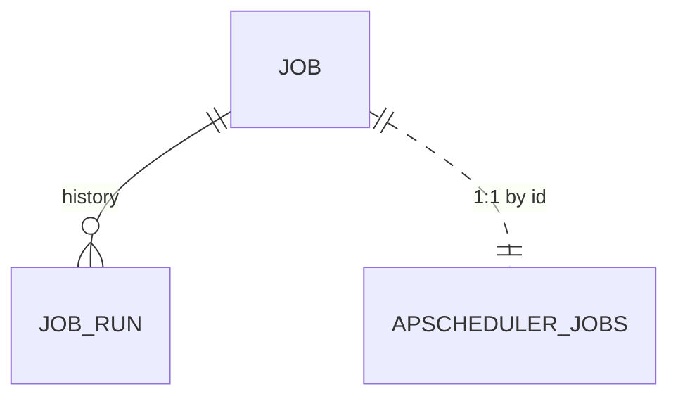

# Data Model — Tasks & Scheduler

This document is the source of truth for the tasks feature's
persistence layer. It is consumed by Alembic migration `0012_tasks.py`
and by SQLAlchemy 2.0 async models in `src/romarr/tasks/models.py`.
**Two new tables** (`job`, `job_run`) plus an explicit declaration of
APScheduler's own `apscheduler_jobs` table.

## Entity-Relationship Additions



The `apscheduler_jobs` table is owned by APScheduler itself but is
declared in our migration so the schema is reproducible across
deployments and tests.

## Tables

### 1. `job`

| Column | Type | Constraints / Notes |
|---|---|---|
| `id` | TEXT | PK; matches APScheduler's job_id (e.g., `MissingSearch`) |
| `name` | TEXT | NOT NULL; human-readable label |
| `type` | TEXT | NOT NULL CHECK in (`rss_sync`, `cutoff_search`, `missing_search`, `refresh_metadata`, `dat_update`, `backup`, `health_check`, `library_scan`, `auto_check_added`, `custom`) |
| `schedule_cron` | TEXT | nullable; standard 5-field cron expression |
| `schedule_interval_seconds` | INTEGER | nullable; alternative simpler scheduling |
| `enabled` | BOOLEAN | NOT NULL DEFAULT true |
| `next_run_at` | TIMESTAMP | nullable; computed by APScheduler |
| `last_run_at` | TIMESTAMP | nullable |
| `last_run_duration_ms` | INTEGER | nullable |
| `last_run_status` | TEXT | nullable CHECK in (`success`, `failed`, `partial`, `cancelled`) |
| `last_error` | TEXT | nullable; populated when `last_run_status != 'success'` |
| `max_concurrent_instances` | INTEGER | NOT NULL DEFAULT 1 |
| `max_retries` | INTEGER | NOT NULL DEFAULT 3 |
| `is_factory_default` | BOOLEAN | NOT NULL DEFAULT false; sentinel for the seeder |
| `created_at` | TIMESTAMP | NOT NULL DEFAULT CURRENT_TIMESTAMP |
| `updated_at` | TIMESTAMP | NOT NULL DEFAULT CURRENT_TIMESTAMP |

Indexes:

- implicit on PK.
- non-unique on `enabled` for fast filtering during scheduler bootstrap.
- non-unique on `last_run_status` for "show me failed jobs" filtering.

Validators (Pydantic):

- Exactly one of `schedule_cron` OR `schedule_interval_seconds` MUST
  be set, EXCEPT for `type = 'auto_check_added'` which is
  event-driven and has both NULL.
- `schedule_cron` MUST parse via APScheduler's cron parser
  (validation at save time per FR-025).
- `schedule_interval_seconds >= 30` (no sub-30-second cadences;
  prevents accidental tight loops).
- `max_concurrent_instances >= 1`.

### 2. `job_run`

| Column | Type | Constraints / Notes |
|---|---|---|
| `id` | INTEGER | PK |
| `job_id` | TEXT | NOT NULL; FK → `job.id` ON DELETE CASCADE |
| `started_at` | TIMESTAMP | NOT NULL DEFAULT CURRENT_TIMESTAMP |
| `finished_at` | TIMESTAMP | nullable; NULL while running |
| `duration_ms` | INTEGER | nullable |
| `status` | TEXT | NOT NULL CHECK in (`running`, `success`, `failed`, `partial`, `cancelled`) |
| `items_processed` | INTEGER | NOT NULL DEFAULT 0 |
| `error_message` | TEXT | nullable; populated for `failed`/`cancelled` |
| `output_summary` | JSON | nullable; runner-supplied free-form summary |
| `triggered_by` | TEXT | NOT NULL CHECK in (`scheduled`, `manual`, `command`, `event`); audit attribution |
| `triggered_by_user_id` | INTEGER | nullable; FK → `user.id` ON DELETE SET NULL; populated for `manual` / `command` triggers |
| `cancellation_forced` | BOOLEAN | NOT NULL DEFAULT false; true when force-terminate kicked in (FR-021) |

Indexes:

- non-unique on `(job_id, started_at DESC)` for the per-job history
  view.
- non-unique on `started_at DESC` for the global activity feed.
- non-unique on `status` for filtering.

Notes:

- `running` is the initial value the lifecycle helper writes. It MUST
  transition to a terminal status when the runner returns or the
  shutdown handler terminates it.
- `triggered_by_user_id` is populated only for `manual` / `command`
  triggers carrying an authenticated user from spec 010. Scheduled
  and event triggers leave it NULL.

### 3. `apscheduler_jobs` (APScheduler's own table — declared explicitly)

This is APScheduler's `SQLAlchemyJobStore` table. We declare it in
the migration for reproducibility.

| Column | Type | Constraints / Notes |
|---|---|---|
| `id` | TEXT | PK; matches `job.id` |
| `next_run_time` | DOUBLE PRECISION | nullable; Unix timestamp |
| `job_state` | BLOB | NOT NULL; APScheduler's pickled state |

Indexes:

- non-unique on `next_run_time` for APScheduler's own dispatcher.

This table is read and written exclusively by APScheduler. Romarr's
SQLAlchemy models do NOT map it — we declare it once in the migration
and let APScheduler own it at runtime.

## Default Job Catalogue

The seeder (`src/romarr/tasks/seeder.py`) inserts the nine documented
defaults on first boot. All carry `is_factory_default = true`.

| job_id | type | schedule | enabled |
|---|---|---|---|
| `RssSync` | `rss_sync` | every 15 min (interval 900) | true |
| `CutoffSearch` | `cutoff_search` | cron `0 */6 * * *` | true |
| `MissingSearch` | `missing_search` | cron `0 */12 * * *` | true |
| `RefreshGameMetadata` | `refresh_metadata` | cron `0 3 * * *` (daily at 03:00) | true |
| `DatUpdate` | `dat_update` | cron `0 4 * * 0` (Sunday 04:00) | true |
| `Backup` | `backup` | cron `0 2 * * *` (daily at 02:00) | true |
| `HealthCheck` | `health_check` | every 10 min (interval 600) | true |
| `LibraryScan` | `library_scan` | every 1 h (interval 3600) | **false** |
| `AutoCheckAdded` | `auto_check_added` | (event-driven; both schedule fields NULL) | true |

The seeder also inserts the matching APScheduler job state (a
zero-state row in `apscheduler_jobs` whose `job_state` is the
serialized job definition built from the row above) — APScheduler
then takes ownership.

## Value Types (not persisted)

These live in `src/romarr/tasks/types.py` and are the working memory
of the scheduler.

```python
class JobStatus(StrEnum):
    RUNNING = "running"
    SUCCESS = "success"
    FAILED = "failed"
    PARTIAL = "partial"
    CANCELLED = "cancelled"

class TriggerKind(StrEnum):
    SCHEDULED = "scheduled"
    MANUAL = "manual"
    COMMAND = "command"
    EVENT = "event"

class JobContext(BaseModel):
    model_config = ConfigDict(arbitrary_types_allowed=True)
    job_id: str
    job_run_id: int
    started_at: datetime
    triggered_by: TriggerKind
    triggered_by_user_id: int | None = None
    progress_callback: Callable[[int, int, str], None]    # (current, total, message)
    cancellation_event: asyncio.Event
    kwargs: dict[str, Any] = {}                           # parameterised commands

class JobResult(BaseModel):
    status: JobStatus
    items_processed: int = 0
    summary: dict[str, Any] = {}
    error_message: str | None = None

# Sonarr-compat command shapes

class CommandPayload(BaseModel):
    name: str                         # e.g., "MissingSearch", "RefreshGame"
    extra_kwargs: dict[str, Any] = {} # gameId, libraryId, etc.

class CommandStatus(BaseModel):
    id: int                           # mirrors job_run_id
    name: str
    status: JobStatus
    started: datetime
    ended: datetime | None
    duration_ms: int | None
    triggeredBy: str                  # Sonarr camelCase compatibility
    body: dict[str, Any]              # echoes CommandPayload
```

## Pydantic Schemas

In `src/romarr/tasks/schemas.py`:

- `JobRead` — exposes all `job` columns plus the computed
  `is_paused_by_health: bool` (FR-019), the active `current_run_id`
  if a run is in flight, and `next_run_at` reconciled with
  APScheduler's view.
- `JobUpdate` — `extra='forbid'`; only `schedule_cron`,
  `schedule_interval_seconds`, `enabled`,
  `max_concurrent_instances`, `max_retries` are mutable. Schedule
  fields are mutually exclusive.
- `JobRunRead` — exposes everything; no Create/Update (the lifecycle
  helper writes these rows).
- `TriggerRequest` — empty by default; carries `kwargs` for
  parameterised jobs (e.g., `{"gameId": 42}` for `RefreshGame`).
- `TriggerResponse` — `{job_run_id}`.
- `CommandPayload` / `CommandStatus` — see Value Types.

## Migration `0012_tasks.py` — Summary

1. `CREATE TABLE job` (DDL above).
2. `CREATE TABLE job_run` (DDL above) with the FK to `job` and the
   nullable FK to `user`.
3. `CREATE TABLE apscheduler_jobs` (the APScheduler-owned table) so
   it is reproducibly declared rather than created at first run.
4. No data seeding — the runtime seeder (`seeder.py`) fires on first
   boot to populate the nine defaults; this keeps the JSON-friendly
   default catalogue separate from the DDL migration.

The migration's downgrade path drops the three tables (in dependency
order: `job_run` → `job` → `apscheduler_jobs`).

## Schema Delta — Session 2026-04-29 Clarifications

### `job.schedule_timezone`

Per FR-007a:

```sql
ALTER TABLE job
  ADD COLUMN schedule_timezone TEXT NULL;     -- IANA name; NULL = UTC
```

Validator (PATCH `/system/tasks/{name}`) rejects invalid IANA names
with HTTP 400. APScheduler evaluates cron in this timezone when set,
otherwise UTC. All API timestamps (`next_run_at`, `last_run_at`,
`started_at`, `finished_at`) are returned in UTC ISO 8601 with the `Z`
suffix.

### `scheduler_lock` (SQLite only) — single-instance enforcement

Per FR-005a, only on SQLite (PostgreSQL uses `pg_try_advisory_lock`):

```sql
CREATE TABLE scheduler_lock (
  id          INTEGER PRIMARY KEY CHECK (id = 1),     -- exactly one row
  holder_pid  INTEGER NULL,
  acquired_at TIMESTAMP NULL,
  heartbeat_at TIMESTAMP NULL                          -- updated every 30 s by holder
);

INSERT INTO scheduler_lock (id, holder_pid, acquired_at, heartbeat_at)
VALUES (1, NULL, NULL, NULL);
```

Acquisition: `UPDATE scheduler_lock SET holder_pid = ?, acquired_at = ?, heartbeat_at = ? WHERE id = 1 AND (holder_pid IS NULL OR heartbeat_at < datetime('now', '-30 seconds'))`. Affected rows = 1 means lock acquired. The 30-second heartbeat allows reclamation when a crashed holder leaves the row dirty.

### `job_run` retention is procedural, not schema

Per FR-002a — no schema change. Bulk DELETE at end of every successful
run keeps the 1,000 most recent rows per `job_id`. Index on
`(job_id, started_at DESC)` exists already to make the query cheap.

### `BackupRunner` artefacts — filesystem only, no DB schema

Per FR-027a — backup tarballs live at `<data>/backups/`. No DB rows
record the backup history; `job_run` (audit) is the historical record.
